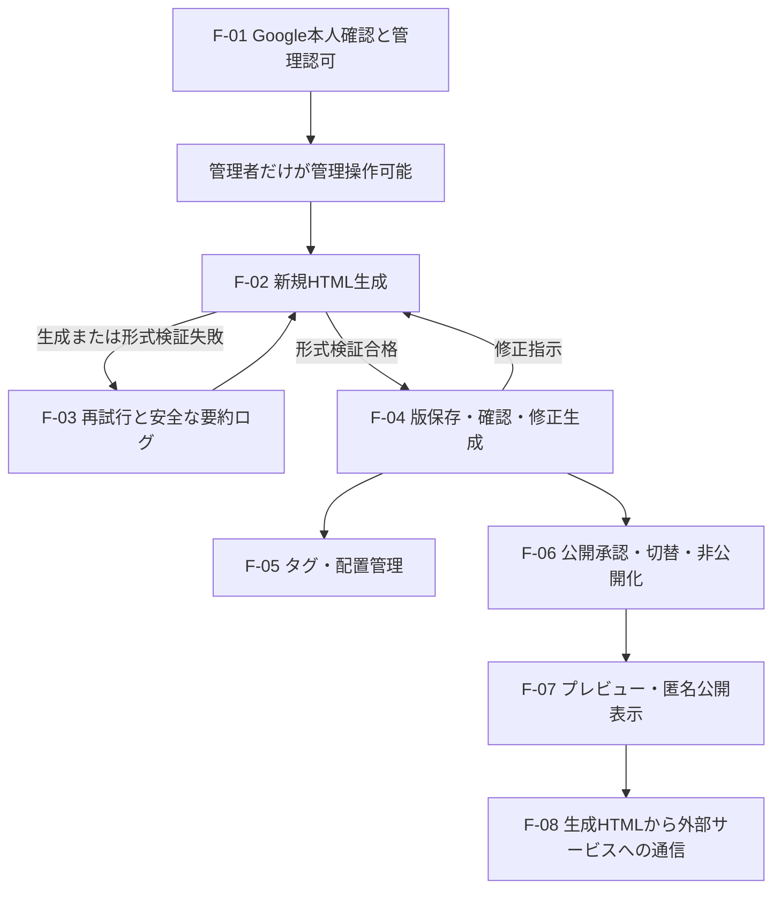

# 主要データフロー

- 対象作業: `L1-M1-S1`
- 状態: 独立レビュー完了・コミット承認待ち
- 関連文書: [論理実行トポロジー](../topology/logical-execution-topology.md)、[横断信頼境界](../trust-boundaries/cross-cutting-trust-boundaries.md)

## 1. 目的と読み方

主要データフローとは、利用者の操作から外部サービス、アプリ内責務、保存、表示まで、重要な情報がどの順に移るかを示すものである。各機能が同じ情報を独自に生成したり、検証・承認を飛び越えたりしないように、正常経路と失敗経路の順序を固定するために必要である。

表中のデータ名は意味を説明するための論理名であり、実装上の型名や属性を確定しない。共有型、識別子、状態、機能間の操作窓口は`L1-M2`、各機能内の詳細は`L2`〜`L6`が所有する。

## 2. 全体フロー

## 3. `F-01` Google本人確認と管理認可

| 順序 | 出発 → 到着 | 渡す意味 | 守る条件と必要な理由 |
| --- | --- | --- | --- |
| 1 | 管理者候補 → 管理操作受付 | Googleログインを開始する意思 | 匿名公開閲覧はこの経路を必須にしない。公開閲覧と管理認証を分けるため |
| 2 | 管理制御領域 ↔ Google | 本人確認に必要な要求と、検証対象となる応答 | 具体方式は`L2`に残す。Google由来というだけで未検証情報を信用しないため |
| 3 | Google本人確認 → 管理認可 | 検証済みのGoogle本人情報 | 事前登録した1メールアドレスとの一致を別に判定する。本人確認と管理者認可は違うため |
| 4 | 管理認可 → 管理操作受付 | 許可または拒否 | 許可時だけ管理操作の継続を可能にし、未登録者の画面操作や直接要求を拒否する |

このフローは認証方式、ログイン継続情報の形式、Web要求へ保存情報を付ける属性を決めない。認証が成功した未登録者は「本人確認済みだが管理者ではない」ため、生成・管理へ進めない。

## 4. `F-02` 新規HTML生成

| 順序 | 出発 → 到着 | 渡す意味 | 守る条件と必要な理由 |
| --- | --- | --- | --- |
| 1 | 管理者 → 管理操作受付 | トピックを最低限含み、追加指示を任意に含む自然言語プロンプト | アプリ独自の対象外トピック分類を追加しない。要件で許された入力範囲を狭めないため |
| 2 | 管理操作受付 → 生成統括 | 管理者として許可された生成開始要求 | 匿名・未登録者からの要求を進めない。生成は管理操作だからである |
| 3 | 生成統括 → Codex app-server | 生成に必要なプロンプトと最小の対応情報 | 認証情報・管理データを混入させない。外部生成先に管理権限は不要だからである |
| 4 | Codex app-server → 生成統括 | 候補HTMLまたは生成失敗 | 候補を未信頼入力として扱う。Codex app-serverの利用は固定でも出力の合格は未確定だからである |
| 5 | 生成統括内の形式検証 | 候補がHTML形式であるかの判定 | 内容品質、特定の閲覧用アプリでの表示、隔離安全性を合格条件へ混ぜない。それらは別の判断だからである |
| 6 | 生成統括 → HTML版管理 | 形式検証に合格したHTML | 合格した結果だけを版として渡す。失敗記録と閲覧可能版を混同しないため |
| 7 | 生成統括 → 生成記録 | 成否と安全な失敗理由 | 詳細内部ログを利用者向け情報へ含めない。`NFR-001`を守るため |

生成完了までの上限時間と目標時間は設けない。ただし、後続の技術設計が障害検出や資源解放に必要な内部制御を設けることを禁止するものではない。内部制御を利用者向け性能要件へ読み替えない。

## 5. `F-03` 再試行と安全な要約ログ

### 5.1 自動再試行

1. Codex app-serverから候補を取得できない、または候補がHTML形式検証に失敗した時点で、同じ共通失敗経路へ入る。
2. 初回試行の後に、自動再試行を最大3回行う。したがって、1回の管理者開始に含まれる試行は最大4回である。
3. 自動再試行が3回失敗したら自動処理を終了し、管理者へ最終エラーの安全な要約を示す。
4. 管理者の手動再試行は新しい開始として扱い、自動再試行を再び最大3回利用できる。

「最大3回」は自動でやり直す回数であり、初回試行を含む総試行数ではない。この区別は承認済みのTask Map（作業構成表）の境界に従う。

### 5.2 失敗時に残すものと進めないもの

| 対象 | 結果 | 必要な理由 |
| --- | --- | --- |
| 生成試行記録 | 失敗として保持する | 管理者が成否と理由を確認できるようにするため |
| 利用者向け表示 | 成否、次の操作判断に必要な安全な失敗理由、自動再試行中か終了済みかを示す | 詳細内部ログを見せずに再試行判断を可能にするため |
| HTML版 | 作成しない | 形式検証に合格したHTMLだけを管理対象の版にするため |
| タグ・配置 | 対象にしない | `BR-014`により失敗記録へタグを付けず、配置対象にも成功版を用いるため |
| 公開状態 | 変更しない | 生成失敗で既存の公開版を失わないため |

## 6. `F-04` 版保存・確認・修正生成

| 順序 | 出発 → 到着 | 渡す意味 | 守る条件と必要な理由 |
| --- | --- | --- | --- |
| 1 | 生成統括 → HTML版管理 | 形式検証に合格したHTML | 初回生成と修正生成を同じ合格境界で受けるため |
| 2 | HTML版管理 → 管理者プレビュー | 管理者が選び、閲覧を許可された版 | 未公開版の確認は管理者だけに許し、表示自体は隔離領域で行うため |
| 3 | 管理者 → 修正操作 | 自然言語の修正指示と、修正元として選んだ版 | 何を修正するかを一意にし、既存版を上書きしないため |
| 4 | 修正操作 → 生成統括 | 修正元HTML、修正指示、生成に必要な入力 | Codex app-serverを用いる共通生成・検証・再試行へ戻すため |
| 5 | 生成統括 → HTML版管理 | 新たに合格したHTML | 新しい不変版として追加し、修正元を上書きしないため |

新しい版の生成中、検証失敗、保存後未承認のいずれでも、現在の公開版は変えない。公開変更は`F-06`の管理者操作だけが起点になる。

## 7. `F-05` タグ・配置管理

| 順序 | 出発 → 到着 | 渡す意味 | 守る条件と必要な理由 |
| --- | --- | --- | --- |
| 1 | 管理者 → タグ・配置管理 | タグの作成・名前変更・付与・解除、任意名の配置先の作成・設定・変更 | すべて管理操作として認可するため |
| 2 | HTML版管理 → タグ・配置管理 | 対象が形式検証に合格したHTML全体であることを確認できる参照 | 失敗記録をタグ・配置対象にしないため |
| 3 | タグ・配置管理 → 管理用永続化 | HTML全体に紐付く現在のタグと配置 | 版ごとに保存せず、公開版切り替えで巻き戻さないため |
| 4 | タグ・配置管理 → 管理者 | 操作後の現在状態 | 管理者が変更結果を確認できるようにするため |

タグと配置の具体的な識別子、同時更新、画面、保存方式は`L1-M2`と`L5`へ残す。

## 8. `F-06` 公開承認・切り替え・非公開化

| 操作 | 入力 | 論理結果 | 維持する条件 |
| --- | --- | --- | --- |
| 初回公開承認 | 管理者が選んだ形式検証合格版 | その版を現在の公開版として示す | 未承認版は匿名閲覧へ出さない |
| 新版の保存 | 新しい形式検証合格版 | 公開状態は変更しない | 従来の公開版を継続する |
| 過去版への切り替え | 管理者が選んだ過去の合格版 | 選択操作を承認とみなし、その版を現在の公開版にする | タグ・配置を過去時点へ戻さない |
| 非公開化 | 管理者の公開取消操作 | 現在公開中の版を匿名閲覧から解決できない状態にする | HTML版履歴自体は削除しない |

公開状態の具体的な状態名、同時操作が競合した場合の処理、公開版の切り替えに必要な保存を一まとまりとして成功または失敗させて途中状態を外部へ見せない性質は`L6`が決める。本作業は「管理者操作が起点」「匿名側からは現在の公開版が0または1件に解決される」という外部結果だけを固定する。

## 9. `F-07` 管理者プレビューと匿名公開表示

### 管理者プレビュー

1. 管理者が閲覧を許可された形式検証合格版を選ぶ。
2. 表示対象解決が、管理者であることと対象版の適格性を確認する。
3. 解決済みHTML本文と、必要性を個別に示した場合だけ、秘密も管理操作能力も持たない最小の表示用情報を生成HTML表示へ渡す。
4. 生成HTMLは、管理画面、管理者のログイン継続状態、管理データへ到達できない領域で表示する。

### 匿名公開

1. 匿名閲覧者が公開対象を要求する。
2. 表示対象解決が、現在公開中の版だけを選ぶ。公開中の版がなければHTML本文を返さない。
3. 解決済みHTML本文と、必要性を個別に示した場合だけ、秘密も管理操作能力も持たない最小の表示用情報を生成HTML表示へ渡す。
4. 管理者プレビューと同じ到達禁止結果の下で表示する。

管理者プレビューと匿名公開は、版を選ぶ資格が異なる。HTMLを実行する領域の権限は同じく最小化し、管理者プレビューだけを信頼済み実行にしない。

## 10. `F-08` 生成HTMLから外部サービスへの通信

1. 生成HTMLは、内容に含まれる外部リソースや機能を利用するため、外部サイト・外部サービスへ要求を作成できる。
2. アプリは外部通信を一律には遮断しない。
3. 外部要求へアプリの認証情報、管理者のログイン継続状態、管理データ、内部サービス資格情報を自動付与しない。
4. 外部サービスが通信元情報や要求内容を記録する可能性は残る。このリスクは要件上受容済みであり、本作業で外部通信禁止へ変更しない。
5. 外部通信の許可を、管理操作用の窓口や管理用永続化への通信許可へ拡張しない。

## 11. フロー間の禁止短絡

| 識別子 | 禁止する短絡 | 禁止理由 |
| --- | --- | --- |
| `FS-01` | Google本人確認成功 → 管理操作 | 事前登録メールとの管理認可を飛ばすため |
| `FS-02` | Codex app-server候補 → HTML版・公開 | HTML形式検証と管理者承認を飛ばすため |
| `FS-03` | 生成失敗記録 → タグ・配置・公開 | 合格HTMLだけを管理対象にする規則へ反するため |
| `FS-04` | 新版保存 → 現在公開版の自動更新 | 管理者承認前の新版を公開するため |
| `FS-05` | 匿名閲覧要求 → 任意版・履歴 | 公開中の版だけという解決規則を飛ばすため |
| `FS-06` | 生成HTML → 管理操作・管理用永続化 | 隔離境界を逆向きに越えるため |
| `FS-07` | 外部通信許可 → アプリ内部通信許可 | `NFR-003`を管理資産への到達許可と誤解するため |
| `FS-08` | 公開版切り替え → タグ・配置の過去状態復元 | HTML版とHTML全体の管理情報を混同するため |
