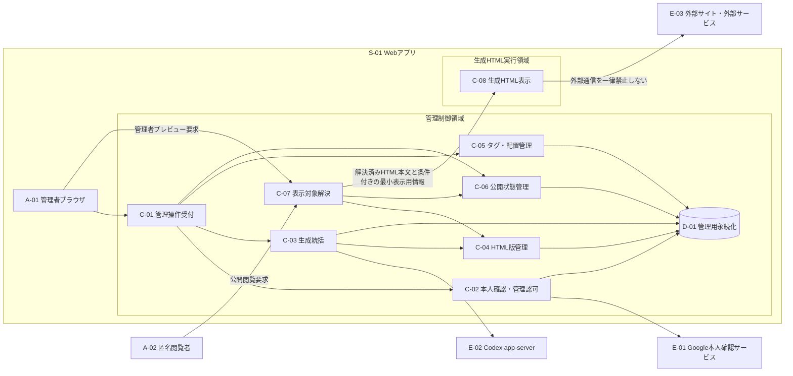

# 論理実行トポロジー

- 対象作業: `L1-M1-S1`
- 状態: 独立レビュー完了・コミット承認待ち
- 根拠: Issue #4、`BR-001`〜`BR-021`、`NFR-001`〜`NFR-006`、`CON-001`

## 1. この文書が決めること

論理実行トポロジーとは、利用者、外部サービス、アプリ内の責務、生成HTMLを実行する領域の間で、誰が何を渡せるかを、採用技術から独立して表した配置である。後続の技術選定が、認証情報と管理データを生成HTMLから隔離しながら、生成HTMLの外部通信を一律禁止しない構成を実現できるか評価するために必要である。

この文書は論理上の責務と到達制約を決める。実行中のプログラム単位、隔離された実行単位、Web上の同一出所単位、配備先提供サービス、通信方式、フレームによる埋め込み、閲覧用アプリの制御規則、Google認証方式、Codex app-serverの起動・接続方式は決めない。これらは後続作業が本書の制約を満たす方法として決める。

## 2. 用語

| 用語 | この文書での意味 | 必要な理由 |
| --- | --- | --- |
| 論理主体 | データを入力、処理、保存、表示する一つの役割。1主体が一つの実行中プログラムや製品に対応するとは限らない | 技術構成を選ぶ前に責任と信頼の差を識別するため |
| 管理制御領域 | 認証済み管理者の生成・確認・修正・タグ・配置・公開操作と、管理データへのアクセスを扱う論理領域 | 生成HTMLと匿名閲覧から管理機能を分離するため |
| 生成HTML実行領域 | Codex app-serverが返したHTMLを、アプリの認証情報と管理データへ到達できない状態で表示・実行する論理領域 | HTML形式の合格だけでは内容の安全性を保証しないため |
| 解決処理 | 管理者プレビューまたは匿名公開の要求を、表示してよい特定のHTML版へ変換する処理 | 閲覧者が保存領域から任意の版を直接取得することを防ぐため |
| 管理データ | 生成試行、HTML版、公開状態、タグ、配置、認証・認可に関して、管理上の判断元としてアプリが保持する情報。利用者向けに公開できる値を含む場合でも、管理上の判断元自体は管理データである。`C-07`が表示可能と解決した1版のHTML本文は管理記録から切り離した表示対象として渡せる。本文以外は、別項目の「表示用情報」の条件を満たす場合だけ渡せる | 公開可否と管理権限の有無を混同せず、生成HTMLから到達禁止にする対象と、表示目的で必要な情報を区別するため |
| 表示用情報 | 表示に不可欠な場合だけ、管理データから切り離して作る、秘密も管理操作能力も持たない値 | 公開可能な値を渡す必要が生じても、管理上の判断元への読書き許可へ拡張しないため |
| 外部サービス | Google、Codex app-server以外に、生成HTMLが画像、データ、機能などを求めて通信するアプリ管理外の相手 | 外部通信を一律禁止しないという要件の行き先を示すため |

## 3. 論理主体

識別子は本文内の照合用であり、実装上の型名、責務ごとのコード単位、Web上の場所識別子、配備単位を指定しない。

| 識別子 | 論理主体 | 担うこと | 担わないことと、その理由 |
| --- | --- | --- | --- |
| `A-01` | 管理者ブラウザ | 単一管理者の入力と操作をWebアプリへ渡し、管理画面とプレビュー結果を表示する | 生成HTMLを管理画面と同じ信頼文脈で実行しない。管理者が開くHTMLも不正な内容を含み得るため |
| `A-02` | 匿名閲覧者 | 閲覧用アプリを通じ、Googleログインなしで現在公開中のHTMLだけを要求・閲覧する | 生成・管理・未公開版選択を行わない。公開閲覧と管理権限を分離するため |
| `S-01` | Webアプリ | `C-01`〜`C-08`と`D-01`を組み合わせ、管理、生成、保存、公開、表示の機能を提供する論理上のシステム | 一つの実行単位や配備製品を意味しない。内部責務と生成HTML実行領域の信頼差を消さないため |
| `E-01` | Google本人確認サービス | Googleアカウントの本人確認に必要なやり取りを行う | アプリ固有の管理者判定、生成、公開状態を所有しない。本人確認とアプリ認可を混同しないため |
| `E-02` | Codex app-server | 自然言語の生成要求に対して候補HTMLまたは失敗を返す | 候補HTMLの形式合格、版保存、公開承認を決めない。外部生成結果を無条件に信頼しないため |
| `E-03` | 外部サイト・外部サービス | 生成HTMLからの通信を受け、外部リソースまたは機能を提供する | アプリの認証情報・管理データを受け取る正当な相手ではない。外部通信許可と秘密情報の公開を分けるため |
| `C-01` | 管理操作受付 | 管理者向けの入力と表示を受け持ち、認証済みの管理操作を管理制御領域へ渡す | 生成HTMLを同じ信頼文脈で実行しない。生成内容による管理操作の乗っ取りを防ぐため |
| `C-02` | 本人確認・管理認可 | Googleの本人確認結果を事前登録済みの1メールアドレスと照合し、管理操作の許可を判定する | Googleの本人確認結果だけで管理者とみなさない。本人確認済みでも未登録者には管理権限がないため |
| `C-03` | 生成統括 | 入力、Codex app-serverへの1回ごとの生成要求、HTML形式検証、再試行、利用者向け要約を統括する | 内容の良否、公開可否、タグ・配置を決めない。それぞれ管理者判断または別責務だからである |
| `C-04` | HTML版管理 | 形式検証に合格したHTMLを版として保持し、履歴と修正元を提供する | 現在の公開版を独自に決めない。履歴を決定する管理元と公開状態を決定する管理元を分けるため |
| `C-05` | タグ・配置管理 | HTML全体に紐付く現在のタグと配置を管理する | HTML版ごとの状態として保存しない。公開版切り替えで巻き戻さないため |
| `C-06` | 公開状態管理 | 管理者の承認、過去版への切り替え、非公開化を扱い、現在公開してよい版を示す | HTML本文やタグ・配置の履歴を所有しない。公開選択を決定する管理元と他の情報を決定する管理元を分離するため |
| `C-07` | 表示対象解決 | 管理者プレビューまたは匿名公開の要求を、表示が許された一つのHTML版へ解決する | 閲覧者に保存領域の検索・任意版取得を許さない。表示用途に必要な最小結果だけを渡すため |
| `C-08` | 生成HTML表示 | 解決済みのHTML本文を生成HTML実行領域で表示する | 管理者資格情報、管理データ、管理操作機能を持たない。生成HTMLからの横断到達を防ぐため |
| `D-01` | 管理用永続化 | 認証・生成・版・タグ・配置・公開に必要な管理データを、各責務の所有規則に従って保持する | 生成HTMLへ直接の読書き手段を提供しない。保存層を経由した迂回到達を防ぐため |

`C-02`〜`C-08`と`D-01`は論理責務である。これらをいくつの実行単位や保存製品へ割り当てるかは本作業では決めない。

## 4. 全体配置

図中の矢印は、矢印の出発側が受け渡しを開始できる方向を表す。一つの矢印には、その開始要求と対応付けられた必要最小限の応答を含むが、到着側から独立した別の処理を開始する権限は含まない。例えば`C-04`から`D-01`への矢印は、版の保存要求だけでなく、`C-04`が開始した版の読取要求への応答も含む。矢印がない主体間には、直接または他主体を悪用した間接到達を設けない。この規約は論理的な開始権限を区別するためのものであり、通信方式は指定しない。

## 5. 横断不変条件

不変条件とは、どの技術を採用しても常に成立させる規則である。

| 識別子 | 規則 | 必要な理由 |
| --- | --- | --- |
| `TI-01` | 生成HTMLは、取得元や管理者の確認有無にかかわらず、管理制御領域から見て信頼できない入力として扱う | HTML形式の機械検証は、スクリプトや外部通信の安全性を保証しないため |
| `TI-02` | `C-08`へ渡せるのは、`C-07`が表示可能と解決したHTML本文と、表示に不可欠で秘密も管理操作能力も持たない最小の表示用情報だけとする | 管理上の判断元を表示領域へ持ち込むと、隔離しても漏えい・変更対象が残るため |
| `TI-03` | `C-08`とそこで動く生成HTMLは、`C-01`〜`C-07`、`D-01`、それらの資格情報や利用者側保存領域へ読書きできない | `BR-021`、`NFR-002`、`AC-019`の到達禁止を成立させるため |
| `TI-04` | `C-08`から`E-03`への通信は一律に禁止しない。ただし、その通信へアプリの資格情報や管理データを自動付与しない | `NFR-003`と隔離要件を同時に成立させるため |
| `TI-05` | 匿名閲覧者は`C-06`が現在公開中と示す版だけを`C-07`経由で取得でき、未公開版、履歴、管理操作へ到達できない | 承認前非公開と未ログイン公開閲覧を両立するため |
| `TI-06` | 管理者プレビューも匿名公開と同じ生成HTML実行領域の制約を受ける | 管理者のブラウザに資格情報があるため、プレビューだけ隔離を弱めると最も大きな漏えい経路になるため |
| `TI-07` | Codex app-serverの候補HTMLは、形式検証に合格するまでHTML版、タグ・配置、公開状態の対象にしない | 外部生成結果と管理対象の境界を保つため |
| `TI-08` | HTML生成失敗と形式検証失敗は同じ再試行統括へ戻し、利用者向けには安全な要約だけを渡す | `BR-004`〜`BR-006`と`NFR-001`を一つの失敗境界で守るため |
| `TI-09` | 公開中の版を新しい未承認版の生成・保存で自動変更しない | 新版の承認までは従来版を公開し続けるため |
| `TI-10` | タグと配置はHTML全体に紐付き、HTML版と公開版の切り替えから独立して保持する | `BR-009`、`BR-020`で定めた異なる変更・維持の周期を守るため |
| `TI-11` | Googleの本人確認と、事前登録済みメールアドレスによる管理者認可を別判定として扱う | Google利用者であることと管理者であることは同じではないため |
| `TI-12` | 初期リリースのHTML生成先はCodex app-serverとし、代替生成基盤へ置換しない | `CON-001`の変更不能な制約を維持するため |

## 6. 後続作業への入力と残す判断

| 後続 | 本作業から渡す確定入力 | 本作業で決めず後続へ残す事項 |
| --- | --- | --- |
| `L1-M1-S2`（Issue #5） | 論理主体、矢印の方向、`TI-01`〜`TI-12`、到達可否 | 各制約を実現するWeb、画面側、サーバー側、永続化、構築、検証の技術と比較理由 |
| `L2` | 本人確認と管理認可の分離、管理者だけが管理操作へ進める境界、生成HTMLへ資格情報を渡さない規則 | Google認証手順、ログイン状態の継続方式、Web要求へ保存情報を付ける仕組みや要求偽造への対策、具体的認可処理 |
| `L3` | Codex app-serverを外部生成主体として扱うこと、候補HTMLを未信頼入力として検証すること、共通再試行境界 | 接続方式、プロンプトへの対応付け、HTML形式判定方式、試行状態と失敗分類 |
| `L4` | 合格HTMLの版管理、未承認新版と公開中版の分離、修正元から生成へ戻る流れ | 版の識別子、保存方式、修正命令、履歴取得方式 |
| `L5` | タグ・配置をHTML全体へ紐付け、版と分離する境界 | 画面、操作、識別子、保存方式、競合処理 |
| `L6` | プレビューと匿名公開の両方で同じ隔離結果を満たすこと、表示対象解決、外部通信を一律禁止しない到達制約 | Web上の同一出所単位、接続先名、HTML表示実行主体、所持者へ限定操作を許す証票、再利用用一時保存、閲覧用アプリの制御などの具体方式 |
| `L7` | 全体配線で越えてはならない境界と、受入試験で観測すべき到達結果 | 実行環境への配線、実際の接続先名、横断試験の実装と証跡形式 |

`L1-M2`は、本書の論理責務を共有用語、識別子、状態の変更責任主体、機能間の操作窓口、論理上の保存データ構造へ変換する。本書はその型や項目を先に決めない。

## 7. 本作業の対象外

- 実行中のプログラム単位、隔離された実行単位、Web上の同一出所単位、Web接続先の名前空間、通信受付番号、Web上の場所識別子、配備先提供サービス、通信網の構成。
- 文書内へ別文書を表示する枠、その埋め込み内容への制限、ブラウザの表示・通信制限、Web要求へ保存情報を付ける属性などの具体的な隔離方式。
- 外部サービスによる認可・本人確認の標準方式や、ログイン状態を継続する具体方式。
- Codex app-serverの起動、接続、プロンプト、応答、時間切れ、終了処理。
- HTML形式判定、版保存、公開状態、タグ、配置の機能固有な型・状態遷移・画面。
- 秘密情報の個別分類、供給、保存、更新方式。これらは`L1-M1-S4`が所有する。
- 本番の配備先提供サービス、運用監視、要件にない通信先制限、学習効果、生成時間目標、特定の閲覧用アプリの保証、測定可能なアクセシビリティ基準。
