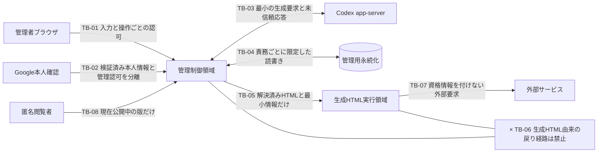

# 横断信頼境界

- 対象作業: `L1-M1-S1`
- 状態: 独立レビュー完了・コミット承認待ち
- 関連文書: [論理実行トポロジー](../topology/logical-execution-topology.md)、[生成HTMLの到達可否](../data-flows/generated-html-reachability.md)

## 1. 目的

信頼境界とは、境界を越えて入るデータや要求を、そのまま正しい・安全・許可済みとみなしてはいけない箇所である。本書は、管理者、匿名閲覧者、Google、Codex app-server、管理用永続化、生成HTML、外部サービスの間に必要な検証・権限・情報最小化を定める。後続設計が具体方式を選ぶ際に、境界を消失させたり、異なる判定を一つにまとめたりしないために必要である。

## 2. 保護対象

| 識別子 | 保護対象 | この作業で定める保護結果 | 詳細を決める変更責任主体 |
| --- | --- | --- | --- |
| `PA-01` | 認証・認可に使う情報と、管理者として操作できる権能 | 生成HTML、匿名閲覧者、外部サービスへ渡さず、未登録Google利用者へ管理権限を与えない | 個別の情報分類は`L1-M1-S4`、認証・認可方式は`L2` |
| `PA-02` | 非公開HTML版、生成試行、失敗記録、詳細内部ログ | 匿名閲覧と生成HTMLから到達させず、利用者へは安全な要約だけを表示する | 型・変更責任主体は`L1-M2`、生成処理は`L3`、版は`L4` |
| `PA-03` | タグ、配置、公開状態などを決定する管理データ | 公開可能な値を含む場合でも管理上の判断元は生成HTMLへ渡さず、管理操作を許可された主体だけが変更する | 型・変更責任主体は`L1-M2`、機能処理は`L5`・`L6` |
| `PA-04` | 公開を承認したHTML本文 | 匿名閲覧者へ表示できるが、管理制御領域への権限を伴わせない | 版は`L4`、公開・表示は`L6` |
| `PA-05` | 管理者が入力する自然言語プロンプトと修正指示 | Codex app-serverへ生成に必要な範囲で渡せるが、認証情報や他の管理データを混入させない | 具体的な要求形状は`L3`・`L4` |

本表は秘密情報の個別台帳ではない。例えばGoogleの画面側へ公開できる設定と秘密値をどう分けるかは`L1-M1-S4`の担当であり、本作業は「生成HTMLへ管理用の資格情報を渡さない」という横断結果だけを固定する。

## 3. 境界一覧

図中の矢印は許可する受け渡しであり、`×`を付けた`TB-06`だけは到達を遮断する境界を表す。境界を越える具体的な通信方式は後続設計に残す。

### `TB-01` 利用者から管理操作受付への境界

- 越えるもの: 自然言語入力、管理操作、閲覧要求、Googleログイン開始要求。
- 必須判定: 入力の形式確認、操作ごとの管理権限確認、参照対象の適格性確認。
- 禁止: 画面に管理操作が見えないことだけを認可の根拠にすること。
- 必要な理由: 匿名閲覧者や未登録Google利用者からも、管理操作相当の要求自体は作成できる可能性があるため。

### `TB-02` Google本人確認からアプリ管理認可への境界

- 越えるもの: Googleが本人確認した結果。
- 必須判定: Google側で検証済みであることと、事前登録した1メールアドレスに一致することを別々に確認する。
- 禁止: Googleアカウントを持つこと、またはメールアドレス文字列を提示したことだけで管理者にすること。
- 必要な理由: `BR-019`は本人確認済み利用者のうち1人だけを管理者とするため。

### `TB-03` 管理制御領域からCodex app-serverへの境界

- 越えるもの: トピックを含む自然言語プロンプト、必要な場合の修正元HTMLと修正指示、生成要求を対応付ける最小情報。
- 戻るもの: 候補HTMLまたは生成失敗。
- 必須判定: 戻る内容を未信頼入力として扱い、HTML形式の機械検証前に版・タグ・配置・公開へ進めない。
- 禁止: 管理者のログイン継続状態、Google資格情報、管理用永続化への資格情報、他の管理データを生成要求へ混入させること。
- 必要な理由: Codex app-serverは必須の生成先だが、アプリの管理権限主体ではなく、返却HTMLの安全性も保証しないため。

### `TB-04` 管理責務から管理用永続化への境界

- 越えるもの: 各責務が所有する認証、生成、版、タグ、配置、公開に関する読み書き。
- 必須判定: 呼出し主体の責務、対象、操作を限定し、生成HTMLと匿名閲覧者に直接の保存アクセスを与えない。
- 禁止: 共通の無制限な保存アクセスを生成HTML表示へ渡すこと。
- 必要な理由: 表示領域を分離しても、保存資格情報や汎用読取機能を渡すと管理データへ間接到達できるため。

### `TB-05` 管理制御領域から生成HTML実行領域への境界

- 越えるもの: 表示対象解決後のHTML本文と、表示に不可欠で秘密でない最小情報。
- 必須判定: 管理者プレビューでは管理者が閲覧を許された版、匿名公開では現在公開中の版だけであること。
- 禁止: 管理者のログイン継続状態、認可結果、管理操作用の窓口、管理画面の文書構造、利用者側の管理用保存領域、非表示の管理データを共有すること。
- 必要な理由: 生成HTMLの内容は管理者が作成を依頼したものでも信頼できず、管理者プレビュー時には特に高い権限が周辺に存在するため。

### `TB-06` 生成HTMLからアプリ内部への戻り境界

- 必要経路: 生成HTMLからアプリ内部へ情報を返す経路は設けない。HTML表示実行主体が自ら観測する表示処理の完了・失敗は、生成HTMLからの戻り値ではない。
- 必須判定: 生成HTMLが作った本文、引数、メッセージをアプリ内部の命令や認証根拠として受け付けず、管理データの読取・変更へつながる代理経路を作らない。
- 禁止: 管理操作用の窓口、認証・認可処理、管理用永続化、非公開版解決、親の管理画面、資格情報への直接・間接アクセス。
- 必要な理由: 表示用HTMLから管理制御領域への逆向き経路があると、隔離が成立しないため。

### `TB-07` 生成HTMLから外部サービスへの境界

- 越えてよいもの: 生成HTML自身が作る外部要求。通信先を一律には禁止しない。
- 自動付与してはいけないもの: アプリの認証情報、管理者のログイン継続状態、管理データ、内部サービスの資格情報。
- 受容する残存リスク: 外部サービスは閲覧者の接続元情報、利用環境情報、生成HTMLが要求へ含めた内容を記録し、追跡に用いる可能性がある。
- 必要な理由: `NFR-003`が外部通信を許容する一方、`NFR-002`はアプリ資産からの隔離を必須とするため。

### `TB-08` 匿名閲覧から公開表示への境界

- 越えるもの: 公開対象を指定する閲覧要求。
- 必須判定: 現在公開中の版が存在する場合だけ、その版へ解決する。
- 禁止: 未公開版、履歴、生成試行、タグ・配置の管理操作、公開状態変更、管理者向けプレビュー権限を匿名要求へ与えること。
- 必要な理由: ログイン不要の閲覧を、ログイン不要の管理へ拡張しないため。

## 4. 境界をまたぐデータの最小化

| 出発 | 到着 | 渡してよい情報 | 渡してはいけない情報 |
| --- | --- | --- | --- |
| 管理操作受付 | Codex app-server | 生成に必要なプロンプト、必要な修正元HTML、修正指示、最小の対応情報 | Google資格情報、管理者のログイン継続状態、管理保存資格情報、公開管理情報、無関係な利用者データ |
| Codex app-server | 生成統括 | 候補HTML、生成結果の成否を判定するための応答 | 応答内の命令を管理操作として自動実行する権限 |
| 生成統括 | 管理者向けログ | 成否、利用者が次の行動を判断できる安全な失敗理由、再試行の外形状態 | 候補HTML全文を含む詳細内部ログ、秘密値、内部処理の呼出履歴、外部サービスの未加工詳細 |
| 表示対象解決 | 生成HTML表示 | 解決済みHTML本文、必要性を個別に示した、秘密も管理操作能力も持たない最小の表示用情報 | 管理者のログイン継続状態、認可主体、全版一覧、管理操作用の窓口、公開可能な値を含む管理上の判断元、保存資格情報 |
| 生成HTML表示 | 外部サービス | 生成HTML自身が構成する外部要求 | アプリが自動付与する認証情報・管理データ |
| 公開状態管理 | 匿名閲覧 | 公開中の版へ解決した結果 | 未公開版の存在・本文・履歴、管理者情報、管理操作能力 |

「渡してよい」は、常に渡すという意味ではない。後続の機能設計は、目的達成に不要な項目をさらに削減する。

## 5. 境界の検証義務

後続の設計・実装・受入試験は、少なくとも次を観測可能にする。

| 識別子 | 検証する結果 | 合格条件 |
| --- | --- | --- |
| `TV-01` | 未登録Google利用者の管理操作 | 本人確認に成功しても、生成・タグ・配置・公開のいずれも許可されない |
| `TV-02` | 匿名閲覧者の公開閲覧 | 公開中の版だけをログインなしで表示でき、管理操作と未公開版は取得できない |
| `TV-03` | 管理者プレビュー中の生成HTML | 管理者の認証情報、管理データ、管理操作機能、親の管理画面へ到達できない |
| `TV-04` | 匿名公開中の生成HTML | アプリの認証情報、管理データ、管理操作機能へ到達できない |
| `TV-05` | 生成HTMLの外部通信 | 管理対象外の外部通信が一律遮断されず、その要求へアプリ資格情報が付かない |
| `TV-06` | Codex app-serverの悪意あるまたは不正な候補 | HTML形式検証前に版・タグ・配置・公開へ進まず、候補内の命令が管理操作として実行されない |
| `TV-07` | 失敗ログ | 管理者は成否と安全な理由を確認できるが、詳細内部ログや秘密値は表示されない |

具体的な検証環境、閲覧用アプリ、接続先名、禁止先へ試験要求を送って遮断を確認する検査用入口は`L7`が定める。本書は特定製品の保証や測定可能なアクセシビリティ要求を追加しない。

## 6. 変更時の再確認条件

次の変更は信頼境界を変えるため、本書との再照合を必要とする。

- 生成HTMLへ新しいアプリ内部機能、利用者情報、保存領域を渡す。
- 管理者プレビューと匿名公開で異なる実行権限を与える。
- 生成HTMLの外部要求へ、アプリ側が保持するWeb要求用の保存情報、通信要求の付加情報、権限や対応関係を示す文字列などを付与する。
- 匿名閲覧から未公開版、履歴、管理機能へ進む経路を追加する。
- Google本人確認とアプリ管理認可を一つの判定へ統合する。
- Codex app-server以外の生成先を追加または置換する。

上記以外でも、[生成HTMLの到達可否](../data-flows/generated-html-reachability.md)の許可・禁止結果が変わる場合は、後続作業だけで境界を緩和せず、G0の再確認対象として扱う。
