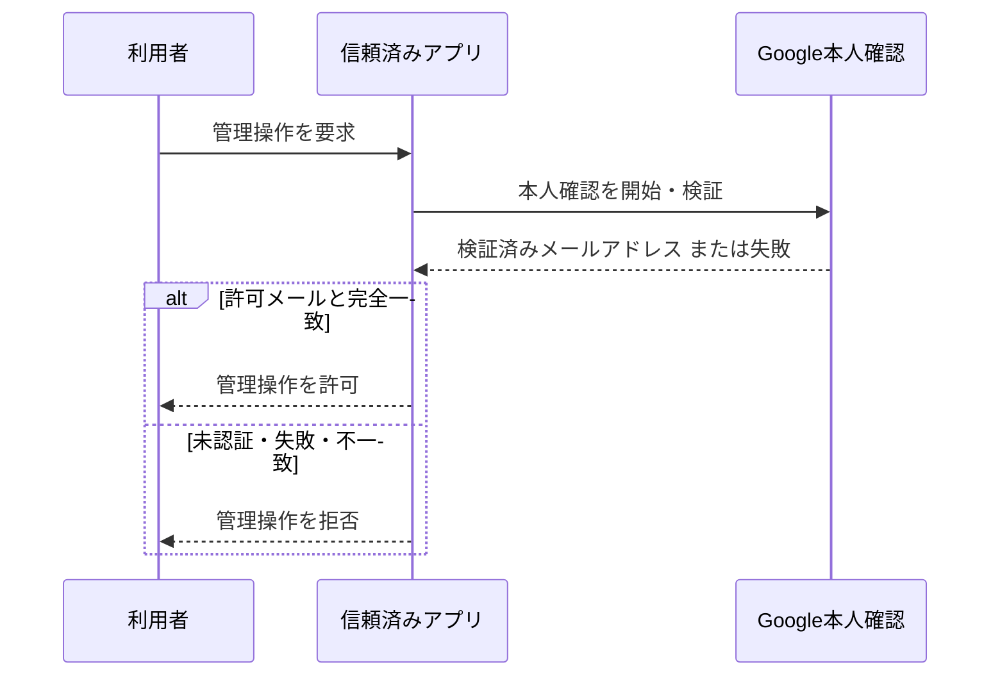

# FEAT-001 詳細設計 — 管理者本人確認と管理アクセス

## スコープ

Google本人確認で得たメールアドレスが、事前登録済みの唯一の許可メールアドレスと一致するときだけ、信頼済みアプリケーションの管理操作を許可する。閲覧者の公開閲覧には本人確認を要求しない。

## シナリオ

### 正常系

1. 利用者が管理操作を開始する。
2. アプリケーションはGoogle本人確認を完了し、検証済みメールアドレスを受け取る。
3. 許可メールアドレスとの完全一致を確認する。
4. 一致時だけ管理操作を継続する。

### 異常系

- 本人確認が未完了・失敗・取消された場合、管理操作を許可しない。
- 検証済みメールアドレスが許可メールと一致しない場合、管理操作を許可しない。
- 管理者状態がない要求が管理操作へ到達した場合、管理操作を実行しない。
- 公開閲覧要求は本人確認の失敗・未実施を理由に拒否しない。ただし公開版以外のアクセス制御はFEAT-003/005の責務である。

## 分析選択

認可判定と外部本人確認の順序が安全性を左右するため、シーケンス図を作成する。状態遷移図は、管理者権限を持つ・持たないの二値であり、追加の状態機械は不要である。

## 責務

| 論理責務 | 内容 |
| --- | --- |
| 本人確認連携 | Googleから検証済みの本人情報を取得する。 |
| 認可判定 | 許可メールアドレスとの完全一致だけを管理者資格とする。 |
| 管理操作ガード | 各管理操作の前に認可済み状態を確認し、未認可なら処理しない。 |
| 公開閲覧分離 | 公開閲覧に管理者資格を要求しない。 |

## 契約・データ

- 許可メールアドレスは信頼済みアプリケーションだけが参照できる設定値であり、生成HTMLや公開表示へ渡さない。
- 本人確認の結果として利用するのはGoogleが検証済みとしたメールアドレスだけである。
- 管理者資格は、現在の本人確認結果が許可メールと完全一致するときに限る。別メールアドレス、未検証メール、クライアント申告値は資格としない。
- 本Featureは永続的な業務履歴、公開API、検索、更新を導入しない。一方、承認済みDEC-FEAT-001に従うOAuth transactionと管理sessionのServer保護記録を使用する。PostgreSQL schema・migrationとoperation別HTTP契約は、[補助設計資料索引](design/index.md)から参照する。

## 承認済みの補助設計

[DEC-FEAT-001](decisions/DEC-FEAT-001.md)により管理session、OAuth transaction、CSRF防御を、[DEC-FEAT-002](decisions/DEC-FEAT-002.md)により配置originとGoogle OAuth登録運用を確定した。共通契約、DB、HTTP、設定、検証、画面設計資料は[補助設計資料索引](design/index.md)を入口とする。

## エラーと安全性

- 拒否理由に許可メールアドレス、秘密値、内部認可情報を含めない。
- 本人確認の失敗と権限不一致は管理操作を許可しない。
- 信頼済みアプリケーションは、管理者資格を非信頼表示境界へ渡さない。別origin隔離の実現と検証はFEAT-005の責務とする。

## 受け入れ・テスト設計

- 許可メールの本人確認済み利用者は管理操作へ到達できる。
- 別メールの本人確認済み利用者、未認証利用者、本人確認失敗・取消利用者は管理操作を実行できない。
- 未認証の閲覧者は公開閲覧の認証要求を受けない。
- 拒否表示・ログに許可メールや秘密情報が出ない。
- 管理操作の認可に使う資格情報を、非信頼表示境界へ渡さないことを単体・境界テストで確認する。別origin隔離の成立確認はFEAT-005の結合テストで行う。
- 有効sessionのlogoutは認可・CSRF検査後にsessionを失効し、信頼済みoriginからの匿名・期限切れ・失効済みsessionのlogoutは業務状態を変更せずcookie削除と`authenticated: false`へ収束する。`Origin`不正時はどちらも`403`でcookieを削除しない。
- 管理プレビュー・履歴・任意版確認などの管理読取りは有効sessionを必須とし、未認可時に管理データを返さない。公開済みHTMLの匿名閲覧にはこの制約を適用しない。
- 管理認証の画面状態、操作、API対応、アクセシビリティは[画面設計仕様書](design/screen-specification.md)で確定する。生成・版管理・公開・タグ・掲載場所の画面内容は各後続Featureが設計する。

## 仮定と未決定

- 画面コンポーネントとfile path・symbolは実装領域で決める。HTTP URI、DB schema・migration、設定・外部境界、transaction・cleanup、検証責務は補助設計で確定済みである。
- L3/L4未決定事項はない。
