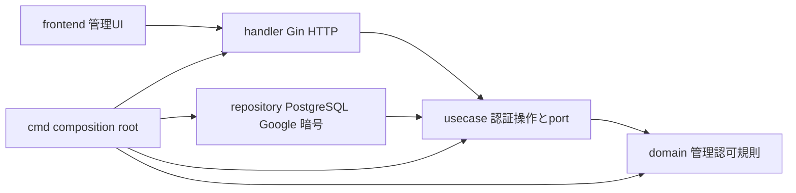
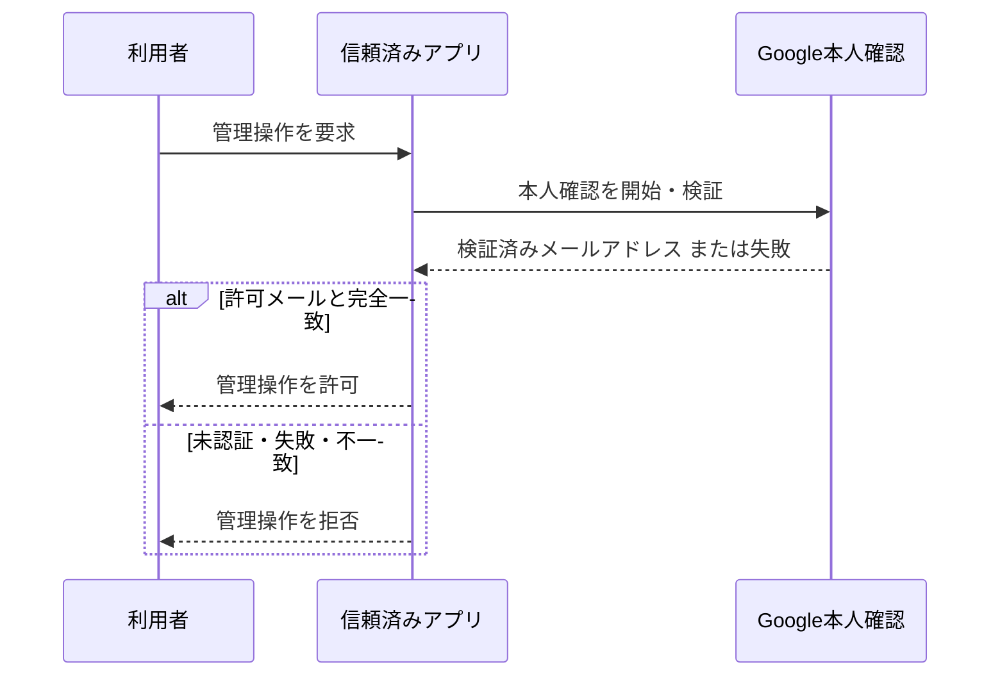

# FEAT-001 詳細設計 — 管理者本人確認と管理アクセス

## スコープ

Google本人確認で得たメールアドレスが、事前登録済みの唯一の許可メールアドレスと一致するときだけ、信頼済みアプリケーションの管理操作を許可する。閲覧者の公開閲覧には本人確認を要求しない。

このFeatureは、既存の認証設定・Google境界を、承認済みDEC-ARCH-003の`backend/`と`frontend/`分離およびClean Architectureへ移行可能な責務・依存境界として定義する。Backendは`handler`、`usecase`、`repository`、`domain`とcomposition rootで明示的に分け、Ginは`handler`以外で使わない。

## Scope / Out of Scope

### Scope

- `backend/`に信頼済みの認証Backendを置き、`frontend/`に同一originの管理UIを置く論理的な分離。
- FEAT-001が所有するOAuth開始・callback、管理session初期化・logout、管理read/mutation guardを、`handler`、`usecase`、`repository`、`domain`へ再配置する境界。
- Google OAuth/OIDC、PostgreSQL保護記録、Server限定設定、Gin HTTP、React管理UIの間で公開・非公開にする契約。

### Out of Scope

- 生成HTMLの隔離originの実装・結合検証、公開閲覧、生成・版・公開・整理のユースケース。
- Hosting事業者、DNS、TLS終端、実環境のorigin値、具体的なpackage名・file名・関数名。

## シナリオ

### 正常系

1. 利用者が管理操作を開始する。
2. アプリケーションはGoogle本人確認を完了し、検証済みメールアドレスを受け取る。
3. 許可メールアドレスとの完全一致を確認する。
4. 一致時だけ管理操作を継続する。

### 異常系

- 本人確認が未完了・失敗・取消された場合、管理操作を許可しない。
- 検証済みメールアドレスが許可メールと一致しない場合、管理操作を許可しない。
- 管理者状態がない要求が管理操作へ到達した場合、管理操作を実行しない。
- 公開閲覧要求は本人確認の失敗・未実施を理由に拒否しない。ただし公開版以外のアクセス制御はFEAT-003/005の責務である。

## Selected Design Analyses

認可判定と外部本人確認の順序、ならびに`usecase`と`repository`の依存方向が安全性を左右するため、OAuth callbackのシーケンス図と構造図を作成する。状態遷移図は、管理者権限を持つ・持たないの二値であり、追加の状態機械は不要である。画面状態、HTTP wire契約、PostgreSQL schema、セキュリティ、永続化・競合、テスト戦略は該当するため補助資料で具体化する。

## Responsibilities and dependency direction

`backend/`は次の論理領域を持つ。名称は配置責務を表すものであり、Feature外の業務概念をここへ追加しない。

| 論理領域 | FEAT-001の責務 | 許可する依存 |
| --- | --- | --- |
| `cmd`（composition root） | 全Server設定・Secretを読取り、存在・形式・origin/callback整合を起動時に検証してから、全層をconstructorで組み立て、HTTP Serverを起動する。業務判断を持たない。 | `handler`、`usecase`、`repository`、`domain`。 |
| `domain` | 管理認可に必要な値・有効性・期限・一回使用・資格状態の不変条件を表す。 | Go標準の最小限の値型・時刻・暗号学的比較。Gin、HTTP、SQL、Google、環境設定を参照しない。 |
| `usecase` | `oauth_start`、`oauth_callback`、session照会、logout、read/mutation認可を実行し、入力を検証して`domain`規則を適用する。外部I/Oをportとして要求する。 | `domain`と`usecase`が定義するport。Gin、PostgreSQL、Google SDK/HTTP、環境変数、cookie型、`repository`実装を参照しない。 |
| `handler` | Ginでroute、middleware、HTTP request/response、redirect、cookieを[HTTP契約](design/http-contract.md)へ変換する。 | `usecase`の入力・出力契約と必要最小限の`domain`値。`repository`、SQL、Google外部呼出しを直接実行しない。 |
| `repository` | PostgreSQL保護記録、Google OAuth/OIDC、暗号乱数・時刻などの`usecase` port実装を提供する。必要な接続情報・Secret・検証済み設定は`cmd`からconstructor注入で受ける。 | `usecase` port、`domain`、各外部技術。環境変数・Secret storeを直接読まず、外部SDK/SQL型を`usecase`/`domain`へ返さず、`handler`を参照しない。 |
| Frontend | 管理UIの画面状態と操作を実装し、同一origin HTTP契約だけを利用する。 | HTTP wire契約。Backend内部、PostgreSQL、Google、秘密値へ依存しない。 |

`E`からの矢印は実行時のcompositionが各要素を組み立てる関係であり、他の矢印はコンパイル時の依存方向を表す。`cmd`だけが環境変数・Secret storeから全Server設定を読取り検証し、`repository`と`usecase`へ必要な依存をconstructor注入する。`handler`は`usecase`を呼び、`usecase`は`domain`と自ら定義するportへ依存する。`repository`は`usecase` portを実装するため`usecase`/`domain`へ依存する。`domain`は他層へ依存しない。`handler → repository`、`usecase → repository`実装、`repository → handler`、`repository`からの環境変数・Secret store読取り、および`domain`からの外部依存を禁止する。

物理配置は、`backend/cmd/`を全Server設定の読取り・起動時検証とcomposition root、`backend/handler/`をGin HTTP境界、`backend/usecase/`をoperationとport、`backend/repository/`をPostgreSQL・Google・暗号などの外部I/O実装、`backend/domain/`を業務規則として分離し、`frontend/`配下に管理UIを置く。このFeatureではこの4層と`cmd`の明示的な配置・依存境界を必須とする。package/fileの細部は実装時に決める。承認済み[DEC-FEAT-003](decisions/DEC-FEAT-003.md)により、`backend/`は独立Go module・独立検証単位であり、Backendの依存は`backend/go.mod`と`backend/go.sum`を正本とする。

## `usecase` ports and `repository` contracts

| `usecase` port | 呼出し側 / 実装側 | 契約 |
| --- | --- | --- |
| 認証トランザクション保護記録 | `usecase` / PostgreSQL `repository` | transactionの発行、置換無効化、条件付き一回使用、期限判定を[session契約](design/session-contract.md)と[DB schema](design/database-schema.md)どおりに提供する。 |
| 管理session保護記録 | `usecase` / PostgreSQL `repository` | sessionの保存、認可可能な現在状態の検索、条件付き失効、業務更新と同一transactionでのidle期限更新を提供する。SQL行・pool・transaction型は外へ出さない。 |
| Google本人確認 | `usecase` / Google `repository` | 固定redirect URIとPKCE verifierでのToken交換、discovery/JWKS取得、ID Tokenの署名・claim検証済み結果または安全な失敗分類を返す。HTTP response、Token平文、provider固有型を返さない。 |
| 認可ポリシー | `cmd` / `usecase` constructor | `cmd`が検証済みの許可メール・trusted originなどから認可に必要な不変の依存を構成して注入する。一般的な環境設定モデルやClient Secret・保護鍵・DB接続文字列を`usecase`の公開入出力へ渡さない。 |
| 時刻・乱数・保護 | `usecase` / 外部`repository` | 期限判定、256 bit乱数、hash、暗号化、定数時間比較に必要な能力を供給する。テストでは決定的なdoubleを差し替えられる。 |

`usecase`は、`handler`が正規化した入力を受け、HTTP status、Gin context、redirect/cookie実装を知らない結果を返す。`handler`だけがその結果を[HTTP契約](design/http-contract.md)のstatus、JSON、header、cookie、`303`へ写像する。Google `repository`は`cmd`からconstructor注入された設定・Secretを使い、Googleの通信失敗を認証失敗として分類する。PostgreSQL `repository`は同様に注入された接続情報・保護鍵を使い、保護記録を安全に使えない状態を`authentication_unavailable`相当として`usecase`へ通知する。いずれも秘密値・Token・許可メールをエラー値に含めない。

## Interfaces / Data and contract completeness

- 許可メールアドレスは信頼済みアプリケーションだけが参照できる設定値であり、生成HTMLや公開表示へ渡さない。
- 本人確認の結果として利用するのはGoogleが検証済みとしたメールアドレスだけである。
- 管理者資格は、現在の本人確認結果が許可メールと完全一致するときに限る。別メールアドレス、未検証メール、クライアント申告値は資格としない。
- 本Featureは永続的な業務履歴、公開API、検索、更新を導入しない。一方、承認済みDEC-FEAT-001に従うOAuth transactionと管理sessionのServer保護記録を使用する。PostgreSQL schema・migrationとoperation別HTTP契約は、[補助設計資料索引](design/index.md)から参照する。
- 物理/wire schema gate: complete。採用済みPostgreSQLのtable、column、制約、index、migrationは[DB schema](design/database-schema.md)、全HTTP operationの入力・成功/失敗形式は[HTTP契約](design/http-contract.md)に定義する。Gin固有のrequest/response型はwire schemaではない。
- `openid email`は、承認済みのOIDC ID Token検証と`email_verified=true`のメールによる完全一致認可から導く最小固定scopeである。`profile`など追加scopeは不要であり要求しない。`schema_migrations`のDDLと適用記録順は、承認済みのPostgreSQL migration runner専用・再適用防止・transaction/rollback契約から導くL1の具体化である。新たなL3/L4判断はない。
- operation documentation gate: complete。全operation、図、DB access map、ログイン操作列は[補助設計資料索引](design/index.md)に列挙する。

## Screen Design

画面設計 gate: complete。[画面設計仕様書](design/screen-specification.md)が、FrontendがHTTP契約だけに依存して認証状態、ログイン、callback後の遷移、logout、障害、アクセシビリティを実装する条件を定める。FrontendはOAuthのSecret、Google/DB client、Backend内部モデルを保持しない。

## 承認済みの補助設計

[DEC-FEAT-001](decisions/DEC-FEAT-001.md)により管理session、OAuth transaction、CSRF防御を、[DEC-FEAT-002](decisions/DEC-FEAT-002.md)により配置originとGoogle OAuth登録運用を確定した。共通契約、DB、HTTP、設定、検証、画面設計資料は[補助設計資料索引](design/index.md)を入口とする。

## Error / Edge Cases and security

- 拒否理由に許可メールアドレス、秘密値、内部認可情報を含めない。
- 本人確認の失敗と権限不一致は管理操作を許可しない。
- 信頼済みアプリケーションは、管理者資格を非信頼表示境界へ渡さない。別origin隔離の実現と検証はFEAT-005の責務とする。
- Gin middlewareは`handler`で共通ヘッダー・route単位の`usecase`呼出しを担えるが、許可メール照合、session有効性、CSRF照合、Google claim検証、SQL実行をmiddleware内に重複実装しない。これらは`usecase`/`domain`とportに一意に置く。
- Browserへ返すのはHTTP契約のJSON、redirect、cookieだけである。層間のエラー、Ginの内部エラー、PostgreSQL/Googleの詳細は一般化した失敗へ変換し、ログにも秘密値を記録しない。

## 受け入れ・テスト設計

- 許可メールの本人確認済み利用者は管理操作へ到達できる。
- 別メールの本人確認済み利用者、未認証利用者、本人確認失敗・取消利用者は管理操作を実行できない。
- 未認証の閲覧者は公開閲覧の認証要求を受けない。
- 拒否表示・ログに許可メールや秘密情報が出ない。
- 管理操作の認可に使う資格情報を、非信頼表示境界へ渡さないことを単体・境界テストで確認する。別origin隔離の成立確認はFEAT-005の結合テストで行う。
- 有効sessionのlogoutは認可・CSRF検査後にsessionを失効し、信頼済みoriginからの匿名・期限切れ・失効済みsessionのlogoutは業務状態を変更せずcookie削除と`authenticated: false`へ収束する。`Origin`不正時はどちらも`403`でcookieを削除しない。
- 管理プレビュー・履歴・任意版確認などの管理読取りは有効sessionを必須とし、未認可時に管理データを返さない。公開済みHTMLの匿名閲覧にはこの制約を適用しない。
- 管理認証の画面状態、操作、API対応、アクセシビリティは[画面設計仕様書](design/screen-specification.md)で確定する。生成・版管理・公開・タグ・掲載場所の画面内容は各後続Featureが設計する。
- Backendの構造検査で、環境変数・Secret storeを読むのが`cmd`だけであること、`domain`が他層へ、`usecase`がGin・PostgreSQL・Google・環境設定・`repository`実装へ、`handler`が`repository`へ、`repository`が`handler`へ直接依存しないこと、Gin `handler`がHTTP wire契約を満たすこと、port doubleで`usecase`の正常・主要異常系を検証することを確認する。

## 仮定と未決定

- 画面コンポーネントとfile path・symbolは実装領域で決める。HTTP URI、DB schema・migration、設定・外部境界、transaction・cleanup、検証責務は補助設計で確定済みである。
- L3/L4未決定事項はない。Backendの独立Go module・独立検証単位は[DEC-FEAT-003](decisions/DEC-FEAT-003.md)で承認済みである。
