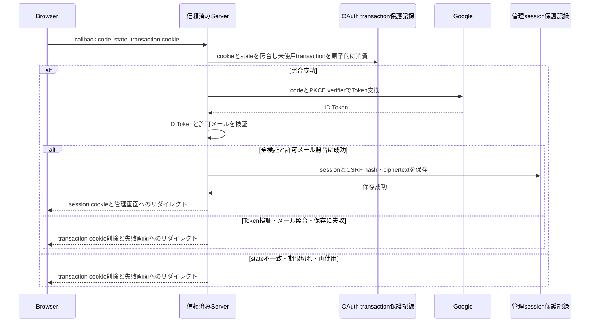

# `oauth_callback` — Google callbackと管理session作成

## 決定根拠

本資料は承認済みの[DEC-FEAT-001](../../decisions/DEC-FEAT-001.md)の選択肢Aを具体化する確定設計である。

## I/O

method、URI、query、redirect、cookie属性は[HTTP契約](../http-contract.md)に従う。

- 入力: Googleからの`code`と`state`、またはGoogleが返す認可エラー。Browserはtransaction cookieを併せて送る。
- 正常出力: 固定された管理画面への`303`リダイレクト、かつ新しいsession cookieの設定。Google Token、ID Token、許可メール、CSRF tokenはリダイレクト先・URL・ログに出さない。`Cache-Control: no-store`を必須とする。
- 失敗出力: session cookieを設定せず、transaction cookieを削除した上で、固定のログイン失敗画面へ`303`リダイレクトする。画面には再試行可能な一般化した案内だけを示す。`Cache-Control: no-store`を必須とする。

## 状態変更・失敗処理

1. Browserのtransaction cookieと受信`state`から、一致する未使用・未期限切れtransactionを検索する。両方の照合に失敗した場合は、Google Token交換を行わない。
2. 該当transactionを、同時callbackに対して一回だけ使用できるよう原子的に`consumed`へ変更する。競合して既に使用済みなら失敗にする。
3. Googleが認可エラーを返した場合は、Token交換を行わず失敗にする。
4. `code`を用いるToken交換では、保存済みPKCE verifierと固定redirect URIだけを使用する。
5. DEC-ARCH-003で承認済みのID Token検証を全て成功させる。任意の検証失敗は認可失敗とする。
6. `email_verified=true`のメールを、Server限定の現行許可メール設定と完全一致で照合する。不一致ならsessionを作成しない。
7. session参照値とCSRF tokenを生成し、照合用hash、Server保護鍵によるciphertext、認可済みメール、発行時刻、8時間の絶対期限、30分のアイドル期限を持つsessionを保存する。保存成功後だけsession cookieを設定する。CSRF tokenの平文は保存・redirect返却しない。
8. 成否にかかわらずtransaction cookieを削除する。OAuth transactionは再利用しない。

## transaction・cleanup

- transactionの照合と`consumed_at`の条件付き更新は、`consumed_at IS NULL`、`invalidated_at IS NULL`、未期限切れを同時に満たす一行だけを対象にする短いDB transactionで行う。更新0件は再使用・競合・期限切れとして失敗する。
- Google Token交換とJWKS取得はDB transaction外で行う。timeout、非2xx、形式不正、検証失敗ではsessionを作らず、consumed済みtransactionを復活させない。retryしない。
- 許可確認後のsession INSERTが失敗した場合、session cookieを出さず失敗redirectする。callbackは既に消費済みのため、利用者は新しいログイン開始からやり直す。
- Browserへのcookie設定・redirect送信失敗をServerが観測できても、作成済みsessionを復活させない。sessionは期限または保守削除で回収され、利用者は再ログインする。

