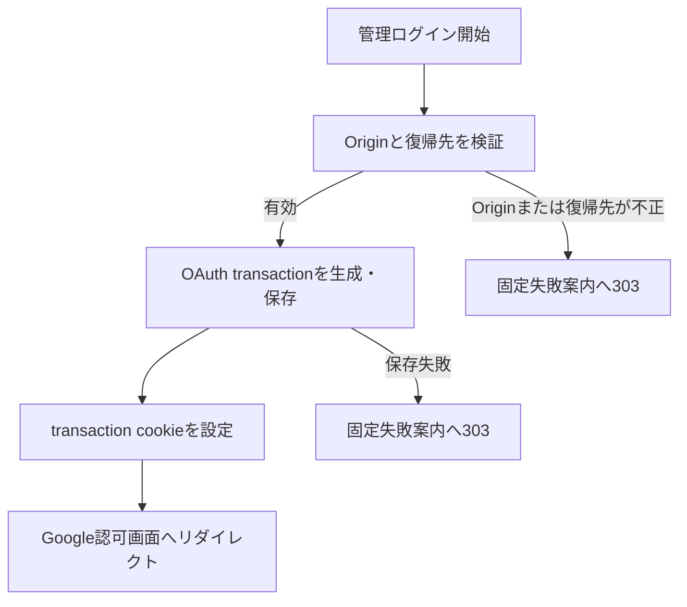

# `oauth_start` — Google認可開始

## 決定根拠

本資料は承認済みの[DEC-FEAT-001](../../decisions/DEC-FEAT-001.md)の選択肢Aを具体化する確定設計である。

## I/O

method、URI、form入力、status、cookie属性は[HTTP契約](../http-contract.md)に従う。

- 入力: 同一originのBrowser form POST。復帰先は現在`/admin`だけを許可し、省略時も`/admin`とする。外部URL・protocol-relative URL・認証callback自身を受け付けない。
- 正常出力: Google Authorization Endpointへの`303`リダイレクト。queryにはこのtransaction専用の`state`、`nonce`、PKCE code challenge、事前設定済みclient識別子、固定redirect URI、必要最小限のOIDC scopeだけを含める。`Cache-Control: no-store`を必須とする。
- 失敗出力: Googleへリダイレクトせず、transaction cookieを変更しないまま固定失敗案内へ`303 /admin/login?reason=failed`する。内部理由、許可メール、client secret、transaction値は返さない。`Cache-Control: no-store`を必須とする。

## 状態変更

1. `Origin`が欠落・複数・trusted app originと不一致なら、transactionを変更せず固定失敗案内へ`303`で終了する。
2. 復帰先が`/admin`以外なら、transactionを変更せず固定失敗案内へ`303`で終了する。
3. `return_path` fieldが重複または不正値なら、transactionを変更せず固定失敗案内へ`303`で終了する。
4. 既存の未使用transaction cookieがあれば、その対応transactionを無効化してcookieを置換する。
5. `state`、`nonce`、PKCE verifier、transaction参照値を新規に生成する。
6. 共通セッション契約のServer保護記録へ、各秘密値のハッシュまたは暗号化値、固定復帰先、10分の期限、`unused`状態を原子的に保存する。
7. transaction cookieを設定してGoogleへリダイレクトする。

既存transactionの無効化と新規INSERTが失敗した場合はcookieを設定せず、固定失敗案内へ`303`し、Googleへredirectしない。Google Authorization Endpointへのredirect後にBrowserが中断しても、transactionは10分で失効し保守操作が回収する。

