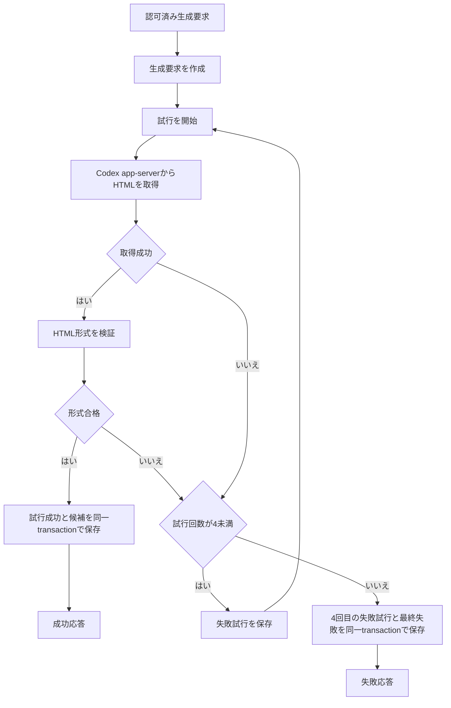
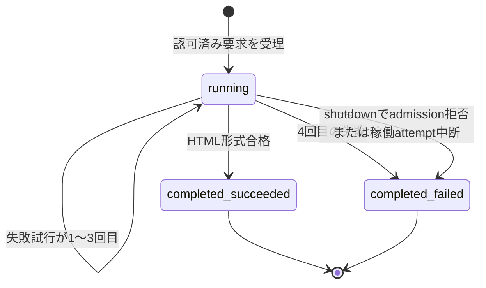
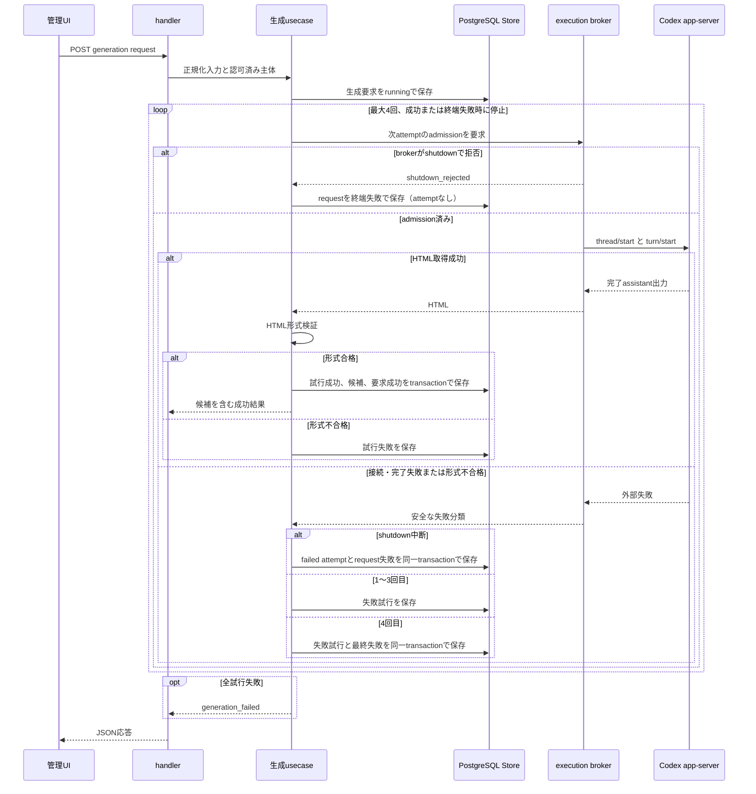

# FEAT-002 詳細設計 — 解説HTMLの生成と失敗復旧

## Feature Summary

管理者がトピックと任意の表現指示を送信すると、信頼済みアプリケーションがCodex app-serverをServer側から利用し、HTML形式を検証する。初回1回と自動再生成最大3回、合計最大4回を実行する。合格出力は検証済みHTML候補として保存し、全失敗時は安全な要約を返す。

候補を合格済み版へ採用するのはFEAT-003、候補または版を別originで確認表示するのはFEAT-005である。[DEC-FEAT-001](decisions/DEC-FEAT-001.md)でこのFeature間契約を承認済みとした。

## Scope / Out of Scope

対象・対象外は[Feature要件](requirements.md)を正本とする。候補の公開、合格済み版・コンテンツ・タグの管理、別originを実際に配信・表示する実装は対象外である。

## Related Requirements / Business Rules

REQ-001–014、BR-002–005・BR-016、NFR-001・003–006、CON-001・003・004、ASM-001に対応する。HTML形式以外の対象トピック制限、内容品質の自動評価、外部通信の成功や完了時間の保証を追加しない。

## Behavioral Scenarios

### 初回生成が合格する

1. 認証済み管理者がトピックと任意の指示で生成を開始する。
2. 管理mutation guardがsession、Origin、CSRFを検査し、生成要求を受理する。
3. 最大4回まで、Codex app-serverからHTMLを取得して形式検証する。
4. 最初に合格したHTMLを候補として保存し、試行結果を全件記録して成功応答を返す。
5. 管理UIは候補の保存と試行回数を表示する。隔離表示はFEAT-005で提供する。

### 修正生成が合格する

1. 管理者がFEAT-003の合格済み版を選び、修正指示を送る。
2. FEAT-002はversion source portにより、その版の検証済みHTMLと参照可能性を取得する。
3. 元HTMLと修正指示をCodex app-serverへ渡し、初回生成と同じ検証・最大試行・候補保存を行う。
4. 新規候補だけを返し、元の合格済み版・公開状態を変更しない。

### すべての試行が失敗する

1. 取得不能またはHTML形式不合格を、試行失敗として記録する。
2. 失敗した回数が4未満なら次の試行を始める。4回目なら停止する。
3. 生成要求を最終失敗として保存し、管理者へ一般化済み失敗要約を返す。
4. 管理者は新しい生成要求を開始できる。失敗要求を再開・再利用はしない。

## Selected Design Analyses

シナリオ、主・代替・異常フロー、状態遷移、責務、外部port、永続化、エラー、セキュリティ、画面、テスト、operation別フローチャートとシーケンス図を採用した。Codex app-server、PostgreSQL、認可済み管理HTTP、Browserが相互作用するためである。

コンテンツライフサイクルの状態遷移は扱わない。候補は不変で、生成要求は同期operation中に`running`となり、完了時にだけ`completed_succeeded`または`completed_failed`となる。

## Responsibilities

| 論理責務 | 責務 |
| --- | --- |
| `handler` | HTTPの入力・認可結果・安全なJSON応答への変換。 |
| `usecase` | 入力検査、再試行上限、失敗分類、HTML検証、候補・試行履歴の保存順序を制御する。 |
| `domain` | 最大4試行、成功時停止、未検証HTMLを候補にしない不変条件を保持する。 |
| `repository` | PostgreSQL、Codex execution broker、時刻をusecase portとして実装する。broker clientはServer側で入力・安全な結果だけを変換し、brokerがCodex app-server JSON-RPCと子processを所有する。 |
| `cmd` | Go Serverのprivate IPC endpointだけを読取り検証し、broker clientへ注入する。brokerの実行可能ファイル・workdir・資格情報は読取らない。 |
| Frontend | 同一origin HTTP契約だけで生成状態・失敗要約・候補参照を表示する。 |

Codex app-serverはrepository側のbroker clientだけが要求し、brokerがv2 JSON-RPCと子processを所有する。ローカルのv2 schemaで確認した`thread/start`、`turn/start`、`item/completed`、`turn/completed`のwire、出力選択、実行/認証分離、shutdownは[Codex app-server adapter契約](design/codex-app-server-adapter.md)を正本とする。JSON-RPC message、thread/turn ID、モデル設定、接続資格情報、外部詳細エラーをusecase・domain・Browser・候補へ出さない。

## State / Interaction

外部I/Oを含むため、DB transactionをbroker経由のCodex呼出し中に保持しない。要求・1〜3回目の失敗試行は個別transactionで記録し、成功試行、候補、要求成功状態は同一transactionで確定する。成功候補がない最終失敗では、4回目またはshutdown中断の試行記録と要求失敗状態を同一transactionで確定する。brokerがadmissionを拒否した場合は外部interactionがないため、要求失敗状態だけを同一transactionで確定する。

## Interfaces / Data

| port | 入力 | 出力・規則 |
| --- | --- | --- |
| CandidateGeneration | 完成済みの初回または修正プロンプト | brokerが原子的にadmitした場合はHTML本文1件または安全な`generation_unavailable`分類を一回だけ返す。brokerが`closing`/`closed`なら`shutdown_rejected`を返し、外部interaction・attempt履歴を作らない。app-serverの内部IDや詳細エラーは返さない。 |
| HTMLFormatValidator | HTML本文 | `valid`または`invalid_html`。 |
| GenerationStore | 要求、admit済み試行、候補、終端失敗の種別 | [DB schema](design/database-schema.md)どおりにtransaction境界を守る。4回目またはshutdown中断はattempt付きT4、brokerの`shutdown_rejected`はrequest-only T4であり、後者でattemptを作らない。 |
| VersionSource | 合格済み版ID | 修正用の検証済みHTMLを返す。見つからない・非合格・非参照可能は`source_version_not_available`。FEAT-003が実装する。 |
| Clock | 現在時刻 | 試行順・記録時刻に使う。 |

HTML形式は、UTF-8として扱える空でない文字列であり、HTML5 parserが解析でき、明示的な`<!doctype html>`、開始・終了する`html`、`head`、`body`要素をすべて持つ完全なHTML文書である場合にだけ合格とする。script、外部URL、内容の真偽・品質は検査しない。形式不合格本文は保存・表示しない。

物理schemaとmigrationは[DB schema](design/database-schema.md)、HTTP wire schemaとoperation別設計は[HTTP契約](design/http-contract.md)、外部process/wireは[Codex app-server adapter契約](design/codex-app-server-adapter.md)、画面状態は[画面設計](design/screen-specification.md)、operation資料の入口と検証は[設計索引](design/index.md)を参照する。

## Contract Completeness

| 対象 | 状態 | 根拠 |
| --- | --- | --- |
| 生成要求・試行・候補の論理データ | complete | 本資料とDB schema。 |
| PostgreSQL physical schema / migration | complete | [DB schema](design/database-schema.md)。 |
| 管理HTTP API | complete | [HTTP契約](design/http-contract.md)。 |
| operation documentation | complete | [設計索引](design/index.md)とoperation資料。 |
| Screen Design | complete | [画面設計](design/screen-specification.md)。 |
| 隔離表示の配信・結合 | not_applicable | FEAT-005が所有する。候補IDのみを後続契約へ渡す。 |

## Error / Edge Cases and Security

- 取得接続不能、途中切断、app-serverの異常完了、HTML抽出不能は`generation_unavailable`として扱う。[adapter契約](design/codex-app-server-adapter.md)のbroker admission、1 process group/attempt、固定wire、通知不整合、HTTP切断、shutdown cleanupの規則に従う。`shutdown_rejected`はattemptを作らず、requestだけを一回だけ終端失敗にする。
- 形式不合格は`invalid_html`として扱う。どちらも同じ再試行回数・最終失敗フローに入る。
- `generation_failed`応答と試行履歴には、分類・試行順・安全な要約だけを含める。Token、接続URI、内部ID、未検証HTML、stack traceは含めない。
- 同一要求の二重実行は、HTTP requestごとに別の生成要求として記録する。失敗要求の再開は許可せず、管理者は新規要求として実行する。
- DB書込みが失敗したら、それ以上の外部再試行をせず500を返す。request作成に失敗した場合は外部呼出しを行わない。外部呼出し後のattempt保存、成功確定、最終失敗確定が失敗した場合は、確定済みの`running`要求が残り得るが候補を作らず、GETでその状態を安全に観測できる。管理者は新規要求を開始できる。
- 修正元の合格済み版が参照不能なら、Codexを呼ばず`source_version_not_available`を返す。
- 管理者session、CSRF token、Codex資格情報、候補HTMLはURL・cookie・ログ・fixtureへ入れない。候補HTMLをBrowserへ配信するのはFEAT-005の別origin経路だけである。

## Security / NFR considerations

FEAT-001の管理read/mutation guardを全operationへ適用する。Codex認証はGo Serverと異なる専用service accountの実行brokerだけが扱い、app-serverへGo ServerのDB、Google OAuth、CSRF、管理sessionの秘密を継承させない。brokerはprivate local IPCだけでGo Serverから生成入力を受け、空の専用作業領域と最小権限でapp-serverを起動する。通常CIではCodex app-serverのtest doubleを使い、実接続は秘密を隔離した環境のsmoke testに限定する。

## Acceptance / Test Design

- 初回要求はトピック必須・任意指示で生成を開始し、合格HTMLで候補と成功試行を保存する。
- 修正要求はFEAT-003の合格済み版だけを元にし、元版・公開状態を変更せず新候補を作る。
- 取得失敗とHTML形式不合格のいずれも、初回を含め最大4試行で停止し、全試行を順に記録する。
- 最初の合格時点で後続試行を実行せず、候補・成功試行・成功要求が整合する。
- 全失敗時は候補を作らず、安全な要約だけを返し、直後に別の新規要求を実行できる。
- shutdownとretry admissionが競合したときは、brokerの直列化順に従い、拒否ならattemptなし、admit済みなら一回だけ中断結果を保存し、いずれも後続retryなしで終端する。
- 未認証、Origin/CSRF不正、session障害ではCodexを呼ばず、FEAT-001の401/403/503契約に従う。
- DB結合試験でmigration、制約、transaction rollback、試行順、候補の不変性を確認する。HTTP・React・E2Eでloading、成功、全失敗、再実行、認可失敗を確認する。
- FEAT-005の結合テストで、候補表示が別originであり資格情報・管理データを渡さないことを確認する。これは共同受入れ条件であり、本Feature単独の完了条件ではない。

## Assumptions

- ASM-001を採用し、再生成最大3回は初回に加算する（L2）。
- 生成要求は同期HTTP operationとして完了結果を返す。NFR-006により完了時間の上限は保証しない。DB transactionは外部呼出しをまたがない。
- 未採用候補はFEAT-002が保持し、自動削除しない。候補の採用後の保持・削除はFEAT-003のライフサイクル設計で決める。
- ASM-002（L2）: `attempt`はbrokerにadmitされた外部interactionを指す。したがってshutdown先行の`shutdown_rejected`はattemptではなく、request-only T4で終端化する。根拠はDEC-FEAT-004の「新規attemptを起動しない」と「稼働attemptだけを中断記録する」の区別である。

## Decisions

- [DEC-FEAT-001](decisions/DEC-FEAT-001.md): 選択肢Aを承認済み。
- [DEC-FEAT-002](decisions/DEC-FEAT-002.md): 選択肢Aを承認済み。
- [DEC-FEAT-003](decisions/DEC-FEAT-003.md): Codex実行資格情報の分離を承認済み（L3）。
- [DEC-FEAT-004](decisions/DEC-FEAT-004.md): shutdown時の生成停止とprocess group契約を承認済み（L3）。

## Open Issues

L3/L4未決定事項はない。Feature Mapおよびtraceabilityの共同受入れ条件への更新は`feature-planning` Ownerが扱う。
