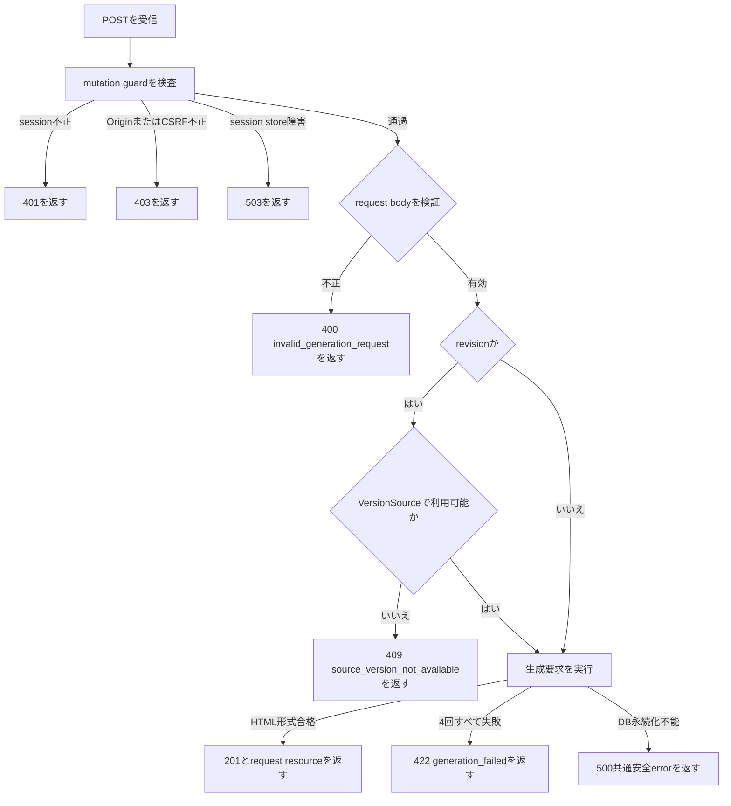
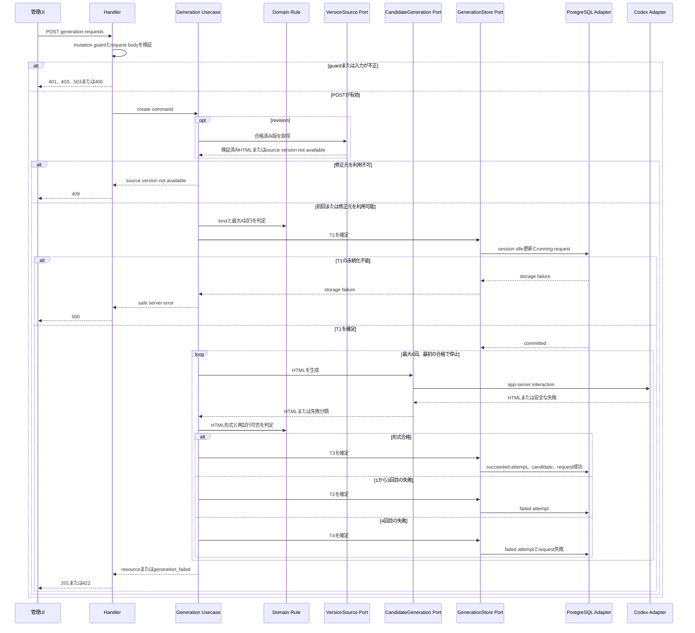
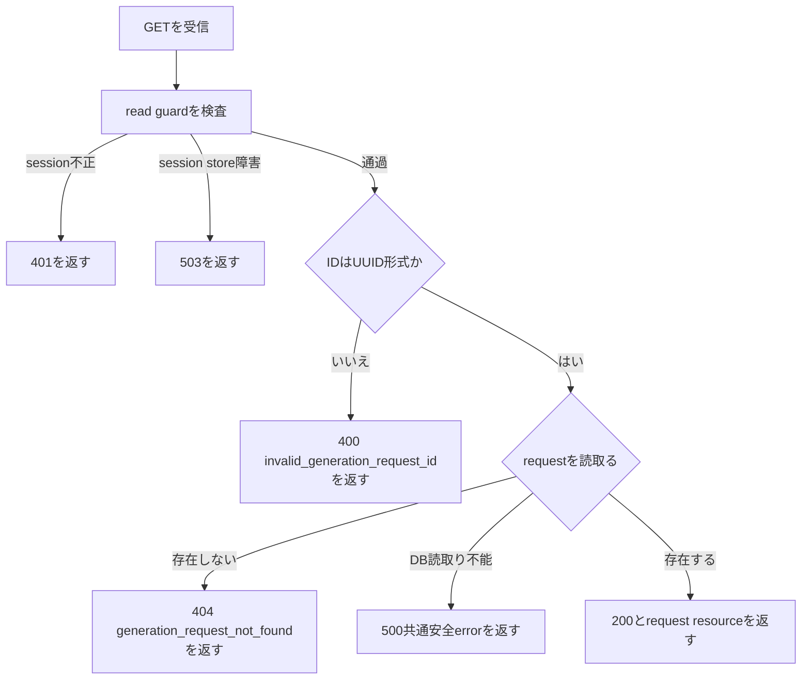
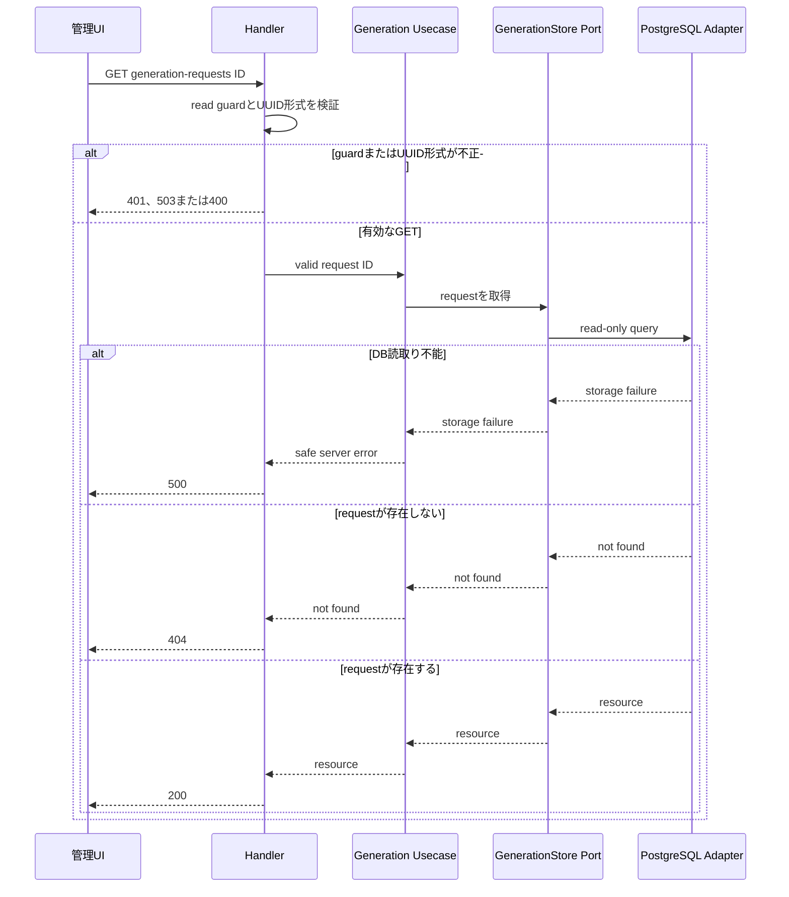

# FEAT-002 管理HTTP契約

## 共通規則

すべて同一originの`/admin` APIであり、JSON、`Cache-Control: no-store`を返す。FEAT-001の管理session guardを再利用する。

| operation                             | guard                                           | 共通失敗                                              |
| ------------------------------------- | ----------------------------------------------- | ----------------------------------------------------- |
| `POST /admin/generation-requests`     | 認証済みsession、信頼済みOrigin、`X-CSRF-Token` | 未認証401、Origin/CSRF不正403、session store障害503。 |
| `GET /admin/generation-requests/{id}` | 認証済みsession                                 | 未認証401、session store障害503。                     |

共通失敗はFEAT-001のerror envelopeとcodeをそのまま使う。本文・URL・ログに候補HTML、CSRF token、session値、Codexの内部IDを含めない。

## POST `/admin/generation-requests` のフローチャート



## POST `/admin/generation-requests` のClean Architectureシーケンス図



Handlerはpresentation adapter、UsecaseとDomain Ruleはapplication/domain、VersionSource・CandidateGeneration・GenerationStoreはoutbound port、PostgreSQL AdapterとCodex Adapterはinfrastructure adapterである。DB transactionと外部app-server interactionを同時に保持しない。各portが返す内部ID、HTML本文、外部詳細errorはHandlerより外へ渡さない。

## GET `/admin/generation-requests/{id}` のフローチャート



`GET`の`200`は常に`Cache-Control: no-store`とする。`running`はGETだけが観測し得る中断記録であり、POSTの最終応答には使わない。

## GET `/admin/generation-requests/{id}` のClean Architectureシーケンス図



Handlerはpresentation adapter、Usecaseはapplication、GenerationStoreはoutbound port、PostgreSQL Adapterはinfrastructure adapterである。read-only queryはtransactionを開かず、候補HTMLや内部エラー詳細はHandlerより外へ渡さない。

## Resource representation

```json
{
  "id": "4bd411cf-7f83-4d0f-bc49-7e2d1c9d8787",
  "kind": "initial",
  "state": "completed_succeeded",
  "topic": "Goのgoroutine",
  "instructions": "初学者向けに説明する",
  "source_version_id": null,
  "created_at": "2026-08-16T09:00:00Z",
  "completed_at": "2026-08-16T09:00:10Z",
  "attempts": [
    {
      "number": 1,
      "outcome": "failed",
      "failure_code": "invalid_html",
      "failure_summary": "HTML文書の形式を確認できませんでした。"
    },
    {
      "number": 2,
      "outcome": "succeeded",
      "failure_code": null,
      "failure_summary": null
    }
  ],
  "candidate": {
    "id": "8d395fab-1731-40bb-9a17-941d5a4dca10",
    "validated_at": "2026-08-16T09:00:10Z"
  },
  "failure": null
}
```

resource representationの全fieldは常に存在する。`topic`、`instructions`、`source_version_id`、`candidate`、`failure`は該当しない場合に`null`である。各attemptも`number`、`outcome`、`failure_code`、`failure_summary`を常に持ち、成功attemptのfailure fieldは`null`である。候補HTML、外部応答、未検証出力はこの表現に含めない。完了済みrequestのattempt数は1〜4、`running` requestは0〜3である。成功後のattemptは含めない。

## POST `/admin/generation-requests`

初回または修正の生成を開始し、外部処理後の最終状態を返す同期operationである。

### Request body

初回:

```json
{
  "kind": "initial",
  "topic": "Goのgoroutine",
  "instructions": "初学者向けに、図の説明を含めてください"
}
```

修正:

```json
{
  "kind": "revision",
  "source_version_id": "a129546c-18c6-46bf-a110-dc525005c1a9",
  "instructions": "例を追加し、導入を短くしてください"
}
```

| field               | rule                                                                                          |
| ------------------- | --------------------------------------------------------------------------------------------- |
| `kind`              | `initial`または`revision`。                                                                   |
| `topic`             | initialで必須のtrim後非空文字列。revisionでは指定不可。                                       |
| `instructions`      | initialでは省略可能な文字列。revisionでは必須のtrim後非空文字列。                             |
| `source_version_id` | revisionで必須のUUID。initialでは指定不可。FEAT-003の参照可能な合格済み版でなければならない。 |

未知field、型不正、kindとfieldの組合せ不正は`400 invalid_generation_request`とする。空白は検証前にtrimし、保存・prompt組立には正規化後の値を使う。

### Response

形式合格時は`201 Created`とresource representationを返す。全試行失敗時は`422 Unprocessable Content`を返す。

```json
{
  "error": {
    "code": "generation_failed",
    "summary": "HTMLの生成を完了できませんでした。新しい要求としてもう一度お試しください。"
  },
  "generation_request": {
    "id": "4bd411cf-7f83-4d0f-bc49-7e2d1c9d8787",
    "kind": "initial",
    "state": "completed_failed",
    "topic": "Goのgoroutine",
    "instructions": null,
    "source_version_id": null,
    "created_at": "2026-08-16T09:00:00Z",
    "completed_at": "2026-08-16T09:00:10Z",
    "attempts": [
      {
        "number": 1,
        "outcome": "failed",
        "failure_code": "generation_unavailable",
        "failure_summary": "生成サービスに接続できませんでした。"
      },
      {
        "number": 2,
        "outcome": "failed",
        "failure_code": "invalid_html",
        "failure_summary": "HTML文書の形式を確認できませんでした。"
      },
      {
        "number": 3,
        "outcome": "failed",
        "failure_code": "generation_unavailable",
        "failure_summary": "生成サービスに接続できませんでした。"
      },
      {
        "number": 4,
        "outcome": "failed",
        "failure_code": "generation_unavailable",
        "failure_summary": "生成サービスに接続できませんでした。"
      }
    ],
    "candidate": null,
    "failure": {
      "code": "generation_unavailable",
      "summary": "生成サービスに接続できませんでした。"
    }
  }
}
```

`source_version_not_available`は`409 Conflict`、そのほかの入力不正は400であり、いずれもCodexを呼ばず生成要求を作成しない。DB永続化不能は500の共通安全errorとし、内部詳細を返さない。

## GET `/admin/generation-requests/{id}`

生成開始後の画面再読込みに最終記録を返す。`id`はUUIDである。存在しない場合は`404 generation_request_not_found`、UUID形式不正は`400 invalid_generation_request_id`を返す。成功時は`200 OK`とresource representationを返す。`running`記録を観測した場合も同じ表現で返せるが、FEAT-002の同期HTTPでは通常クライアントに返らない。

## Error code map

| code                            | HTTP                 | 表示可能なsummary                      | retry                |
| ------------------------------- | -------------------- | -------------------------------------- | -------------------- |
| `invalid_generation_request`    | 400                  | 入力内容を確認してください。           | 修正して新規要求     |
| `invalid_generation_request_id` | 400                  | 要求IDが不正です。                     | 正しい画面へ戻る     |
| `source_version_not_available`  | 409                  | 修正元の合格済み版を利用できません。   | 別の版を選ぶ         |
| `generation_failed`             | 422                  | 生成を完了できませんでした。           | 新規要求             |
| `generation_request_not_found`  | 404                  | 生成要求が見つかりません。             | 一覧・生成画面へ戻る |
| `generation_unavailable`        | representation内のみ | 生成サービスに接続できませんでした。   | 新規要求             |
| `invalid_html`                  | representation内のみ | HTML文書の形式を確認できませんでした。 | 新規要求             |

`generation_unavailable`と`invalid_html`は試行履歴・最終failureの分類であり、外部の例外文や応答本文を置換しない。`generation_failed`の最終summaryは、最後の分類に対応する定型安全文だけである。
