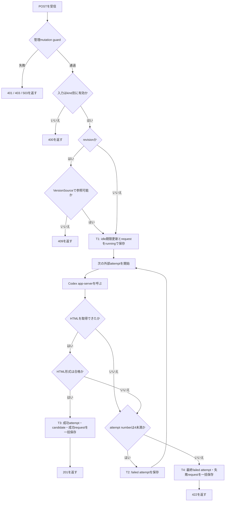
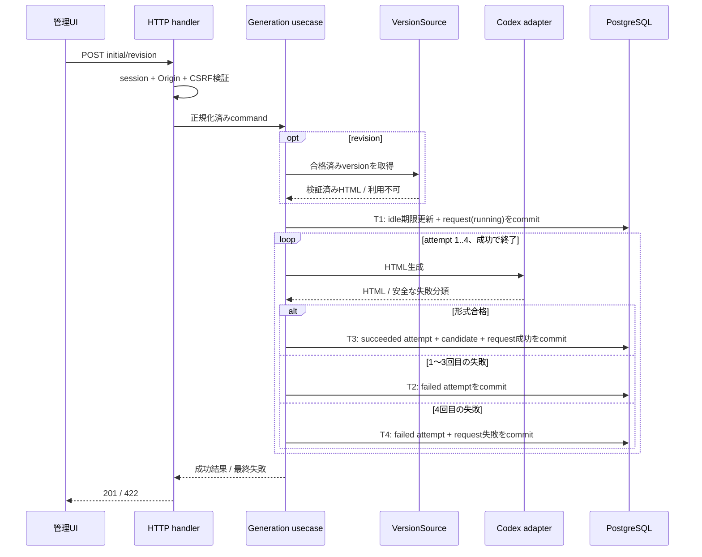

# Operation — `create_generation_request`

## 用語と目的

認証済み管理者の自然言語入力から、初回または修正の解説HTML候補を作る。初回はtopicと任意instructions、修正はFEAT-003の合格済みversionとinstructionsを入力にする。HTMLが形式合格した最初の出力だけを候補にし、初回を含め最大4回の失敗で停止する。

HTTP endpoint、wire schema、共通errorは[HTTP契約](../http-contract.md)、物理永続化は[DB schema](../database-schema.md)を正本とする。

## I/Oと検証

| input | initial | revision | 検証失敗時 |
| --- | --- | --- | --- |
| `kind` | `initial` | `revision` | 400。 |
| `topic` | trim後非空 | 指定不可 | 400。 |
| `instructions` | 任意 | trim後非空 | 400。 |
| `source_version_id` | 指定不可 | UUIDかつ参照可能な合格済み版 | 400または409。 |

初回promptは正規化済みtopicとinstructionsから、修正promptはVersionSourceが返す検証済み元HTMLとinstructionsからServer側で組み立てる。app-serverへ送るpromptは「完全なHTML文書だけを返す」ことを求めるが、モデル出力を信頼せず後段のHTML format validatorで必ず検証する。元HTML、prompt、未検証出力はHTTP応答・DBの試行記録・安全ログに含めない。

成功出力は`201`の候補metadata、全失敗は`422 generation_failed`と要求・試行metadataである。資格情報・Origin/CSRF・session障害は生成を開始せず、FEAT-001共通errorを返す。

## 主・代替・失敗フロー

| 条件 | 規則 |
| --- | --- |
| app-server起動/接続/終了/出力抽出の失敗 | `generation_unavailable`のfailed attempt。 |
| HTML parserまたは完全文書条件の不合格 | `invalid_html`のfailed attempt。本文は捨てる。 |
| 1〜3回目の失敗 | 試行を確定後、次の新しいapp-server interactionを開始する。 |
| 最初の形式合格 | 直ちに停止する。後続attemptを作らない。 |
| 4回目の失敗 | 要求を`completed_failed`にし、再開しない。 |
| requestまたはattemptのDB書込み失敗 | 外部再試行を開始・継続せず500を返す。request作成失敗なら外部呼出しなし。既にcommit済みの`running` requestはGETで読めるが再開しない。 |

## シーケンスと永続化

FEAT-001のmutation guardは、全認可・Origin・CSRF検査を通過した後だけT1でsessionのidle期限と最初の業務状態であるrequestを同一transactionで更新する。T1をcommitしてから外部I/Oを行い、DB transactionを外部呼出しにまたがせない。1〜3回目の失敗はT2としてcommitする。最初の成功はT3でのみ可視化する。4回目の失敗はT4でそのattemptとrequest終端状態を同じtransactionで確定する。どのwrite transactionでもrollback時は500を返し、rollback後に別のattemptや候補保存を行わない。

| 処理ID | transaction内のDB処理 | rollback時の結果 |
| --- | --- | --- |
| T1 | FEAT-001管理sessionのidle期限をUPDATEし、`generation_requests`へ`running`をINSERT | 全rollbackして500。外部呼出しなし。 |
| T2 | 1〜3回目の`generation_attempts`をfailedでINSERT | 500。既存requestは`running`のまま、次attemptなし。 |
| T3 | 成功attemptのINSERT、candidateのINSERT、requestを成功へUPDATE | 全rollbackして500。candidateなし、requestは`running`。 |
| T4 | 4回目failed attemptのINSERT、requestを最終失敗へUPDATE | 全rollbackして500。4回目attemptなし、requestは`running`。 |

## 不変条件・観測可能性・テスト

- requestごとのattemptは1から連番で最大4。candidateがあるなら成功attemptは一つだけでrequest stateは`completed_succeeded`。
- candidateがなければ成功attemptはなく、終了済みrequestは`completed_failed`で安全なfailureを持つ。
- 修正生成は元versionを読み取るだけで、元version、コンテンツ、公開状態を変更しない。
- 記録・応答で観測できるのはrequest ID、状態、試行番号、分類、安全要約、候補IDだけである。
- test doubleで「取得失敗→形式不合格→成功」「4回失敗」「最初の成功」「source versionなし」「commit失敗」を再現する。
