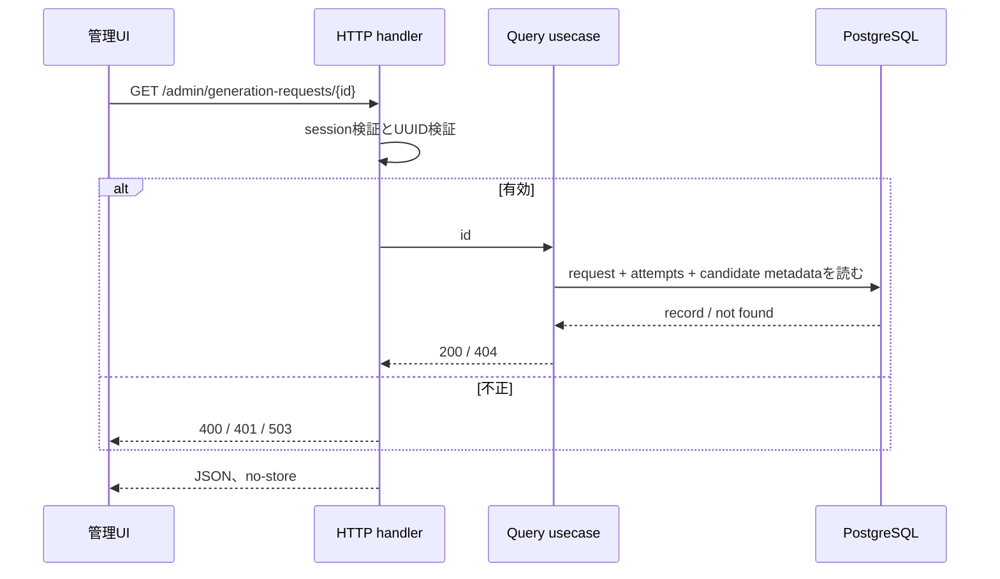

# Operation — `get_generation_request`

## 目的とI/O

画面再読込み時に、認証済み管理者へ一つの生成要求の最終記録を再表示する読取りoperationである。入力はpathのUUID `id`だけで、出力は[HTTP契約](../http-contract.md)のresource representationである。候補HTML本文や外部詳細は返さない。

| 条件 | HTTP結果 | DB / 外部I/O |
| --- | --- | --- |
| sessionが有効、UUIDかつrequestあり | 200とrecord | request、attempt、candidate metadataを読取る。 |
| sessionなし | 401 | DB読取りなし。 |
| session store障害 | 503 | generation table読取りなし。 |
| UUID不正 | 400 | DB読取りなし。 |
| requestなし | 404 | candidateを探索しない。 |

これはread-onlyであり、Codex app-server、VersionSource、HTML validatorを呼ばず、request stateや履歴を更新しない。

## シーケンス

状態遷移や外部呼出しがなく、分岐はHTTP契約で完全に列挙されるため、追加の状態図・フローチャートは不要である。

## 受入れ確認

- 成功表示はattemptの時系列順と候補IDだけを返す。
- `completed_failed`でも安全な最終failureを再表示できる。
- `running`はDB書込み障害後だけ観測され得る中断記録で、attemptは0〜3件である。読んでも再実行・再開・新しいattempt作成をしない。
- 同一requestを繰り返し取得しても永続化データは変化しない。
