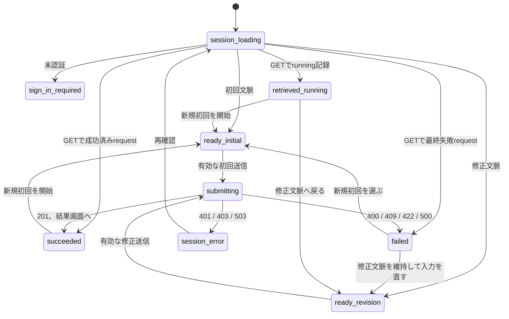

# FEAT-002 画面設計

## 画面と責務

管理同一originに「解説HTMLを生成」画面を提供する。初回生成を開始し、直後の最終結果または安全な失敗を確認する画面である。FEAT-003の版詳細から修正生成へ遷移する場合は、`source_version_id`を画面内部の文脈として受け取り、修正元版IDを編集可能な入力欄として露出しない。

候補HTMLをこの画面に埋込み・直接表示しない。FEAT-005が候補IDを使う隔離表示を提供した後だけ、「隔離表示で確認」の遷移を有効にできる。FEAT-002単独では、候補が保存済みであることと後続Featureの表示責務だけを示す。

| 到達元 | 初期文脈 | 退出先 |
| --- | --- | --- |
| 管理ナビゲーション | 初回生成 | 成功・失敗後の新規初回、ログイン。 |
| FEAT-003の合格済み版詳細 | 修正生成。source versionは内部文脈 | 成功・失敗後の新規修正または元版詳細。 |
| 記録済みrequestの再読込み | GETで最終結果または`running`を取得 | 成功・失敗後の新規初回、または中断記録から新規初回。 |

初回画面は`/admin/generate`、結果再表示画面は`/admin/generate/requests/{generation_request_id}`とする。POSTの201 resourceまたは422の`generation_request`から得たrequest IDをこの結果画面のpath parameterへ渡す。結果画面は初回表示・reloadのどちらでも、そのIDを`GET /admin/generation-requests/{id}`へ渡す。revisionのsource versionはFEAT-003から画面遷移時にのみ渡す内部文脈であり、URL、DOM、編集inputには置かない。

## レイアウトと入力

画面は次の論理領域を上から順に持つ。固定pixel値を契約にせず、狭い画面では一列、十分な幅では操作群を横並びにできる。

| 領域 | 初回生成 | 修正生成 | 操作・内容 |
| --- | --- | --- | --- |
| 見出し | 「解説HTMLを生成」 | 「解説HTMLを修正生成」 | 現在の目的を明確にする。 |
| topic | 必須textareaまたはtext input | 表示しない | 自然言語の題材を入力する。 |
| 修正元 | 表示しない | 元の合格済み版を識別する非編集summary | source version IDそのものは通常表示しない。 |
| instructions | 任意textarea | 必須textarea | 表現、構成、修正内容を自然言語で入力する。 |
| 実行 | 「生成する」 | 「修正して生成する」 | 有効な入力時だけ送信する。 |
| 結果 | 共通 | 共通 | 試行結果と候補metadata、または安全な失敗を示す。 |

入力はlabelを持ち、topicとrevision instructionsには必須を文字とprogrammaticなrequired stateの両方で示す。説明文は「HTMLとして検証できた結果だけが候補として保存される」「生成完了時間は保証されない」を伝える。生成時に内容を自動分類・拒否するUIは設けない。

## 状態と遷移

| UI state | 表示 | 有効な操作 |
| --- | --- | --- |
| `session_loading` | 最小の読込表示 | 入力・送信は無効。 |
| `sign_in_required` | FEAT-001のログイン導線 | ログイン。 |
| `ready_initial` / `ready_revision` | 入力フォーム | 入力、送信。 |
| `submitting` | 「生成中」および時間上限を保証しない説明 | 二重送信防止のため全入力・送信を無効。取消・同一要求の再開は提供しない。 |
| `succeeded` | 候補保存済み、成功までの試行番号・失敗分類 | 新規初回。FEAT-005導入後だけ隔離表示。候補IDは画面に表示しない。 |
| `failed` | codeに対応する安全な要約、記録された試行回数 | 入力修正または新規要求。 |
| `retrieved_running` | 前回の生成記録を完了確認できなかった安全な説明 | 新規要求。以前のrequestを再開しない。 |
| `session_error` | FEAT-001の安全な認証・接続エラー | 再確認またはログイン。 |

送信前のクライアント検証では、必須のtopicまたはrevision instructionsが空なら該当fieldへinline errorを表示し、最初の不正fieldへfocusする。422の`generation_failed`は入力内容を消去せず同じ入力で新規要求を送れる状態に戻す。ただし以前のrequestを再開する操作にはしない。Serverの400はfieldを特定しないform全体の安全なerror、409は修正元summary付近のerror、500はform全体の安全なerrorとして表示する。

## アクセシビリティと安全性

- loading・成功・失敗は`aria-live`で通知し、送信直後のfocusは進行状況へ、入力エラー時のfocusは最初の不正fieldへ移す。
- textarea、送信、再試行はキーボードだけで操作でき、可視focusを持つ。色だけで成功・失敗を区別しない。
- 応答にない候補HTML、Codex応答、資格情報、Codex内部識別子をDOM・console・URL・analyticsに入れない。candidate IDは画面表示せず、後続の隔離表示遷移にだけ内部的に使う。
- 隔離表示導線は管理画面内iframeを作らず、FEAT-005が定義する別originへの通常遷移だけを使う。

## HTTP対応と画面検証

| 操作 | HTTP | 期待する画面結果 |
| --- | --- | --- |
| 初回送信 | POST initial | 201で成功状態、422で安全な最終失敗。 |
| 修正送信 | POST revision | 201で新候補、409で修正元利用不可。 |
| 画面再読込み | GET request | 記録済み結果を再表示。 |
| 未認証・CSRF/Origin/session障害 | FEAT-001共通結果 | ログインまたは安全なsession error。 |

UI component testで必須・任意入力、busy状態、各error、`running`記録、候補本文非表示、focus/live regionを確認する。E2Eでは初回成功、全失敗後の新規要求、修正生成、未認証を確認する。隔離表示はFEAT-005との共同E2Eで確認する。
